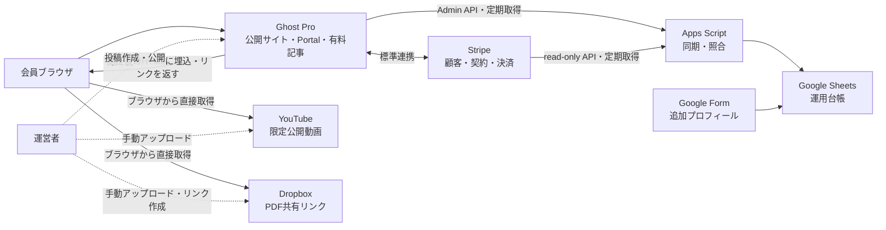

# みんほす会員管理・コンテンツ配信システム 要件定義書

| 項目 | 内容 |
|---|---|
| 文書ID | MH-MEMBER-REQ-001 |
| 版 | 1.1（独立再監査済み） |
| 作成日 | 2026-08-28 |
| 対象 | MVPおよび将来拡張計画 |
| ステータス | MVP実装・再監査・コード／GitHub側接続準備完了／外部Gate 0〜5・実接続・AT・DEC・本番受入は未実施 |
| システム責任者 | みんほす運営責任者（氏名は本番接続前に記入） |

## 0. 結論

本MVPは技術的・運用的に実現可能である。独立再監査で判明した設計上の不足を本版で修正済みであり、次の3条件と第20章の未決事項を運営責任者が承認した後を**Go**、承認前を**No-Go**と判定する。

1. Ghostの有料記事本文は会員認証で保護できるが、記事を閲覧した会員が取得したYouTube限定公開URLおよびDropbox共有URLの再共有は技術的に防止しない。
2. 課金の正本をStripe、実際の閲覧権限の正本をGhostとし、Google Sheetsは通常2時間以内、最長24時間の遅延を許容する運用台帳に限定する。
3. Stripeの支払回収設定は、所定の再試行がすべて失敗した契約を最終的にキャンセルする設定とする。Ghostでは`past_due`と`unpaid`も有料会員として扱われ得るため、キャンセルされるまで閲覧権限が残ることを受容する。

この前提で、Ghost(Pro) Publisher、Ghost標準Members/Portal、Stripe標準連携、Google Sheets、Google Forms、YouTube限定公開、既存Dropboxを組み合わせる。Make、Mux、独自決済画面、独自認証基盤、会員別署名URLはMVPに含めない。

## 1. 背景と目的

### 1.1 背景

みんほすの勉強会で提供するレクチャー動画とPDF資料を、継続課金中の会員へ低コストかつ継続運用可能な形で提供したい。会員情報と課金状態は運営者がGoogle Sheets上で一覧確認できるようにし、非技術者でも日常運用できることを重視する。

### 1.2 目的

- 継続課金中の会員が迷わずログインし、レクチャー動画とPDF資料を利用できること。
- 入会、更新、支払失敗、期間末解約、失効、再入会をGhostとStripeの標準機能で安全に扱うこと。
- 氏名、メールアドレス、所属、肩書き、参加区分、現在の契約状態などを運営用台帳で確認できること。
- 動画・PDFの登録を、運営者がコード変更なしで繰り返せること。
- MVPの固定費と保守対象を抑えながら、将来は署名付き配信や高度な会員管理へ移行できること。

### 1.3 MVP成功条件

| 指標 | 合格条件 |
|---|---|
| 入会 | 正常なテスト決済で重複契約を発生させず有料会員になる |
| 閲覧制御 | 非会員・無料会員には保護本文と外部メディアURLを返さず、有効な有料会員には返す |
| 初回利用 | 同一ブラウザでStripe Checkout成功後にサイトへ戻った時点から、Ghostが有料セッションを認識してライブラリ本文を返すまで通常60秒以内。メール配送時間は除外する |
| 台帳同期 | 通常は2時間以内、遅くとも夜間全件照合後24時間以内に最新状態へ修復される |
| コンテンツ登録 | 動画・PDF・字幕・権利確認完了後、Ghost登録・確認・公開を中央値15分以内で完了できる。アップロード、字幕制作、資料修正は含めない |
| モバイル | iOS SafariおよびAndroid Chromeで入会、ログイン、動画再生、PDF取得、契約管理を完了できる |
| 安全性 | カード情報、API秘密鍵、2FAコードをGhostテーマ、Sheet、Git、ログへ保存しない |

## 2. 決定事項、仮決定事項、未決事項の扱い

### 2.1 確定事項

- Ghost(Pro)を会員サイト兼CMSとして利用する。
- StripeをGhostの標準連携で接続する。
- Google Sheetsを会員・課金状態の運用台帳として利用する。
- 動画はYouTubeへ限定公開でアップロードし、運営整理用の所定プレイリストへ登録する。プレイリスト自体は非公開とし、会員へ共有しない。
- PDFは既存Dropboxの所定フォルダへ保存し、共有リンクを利用する。
- YouTubeへのアップロード、プレイリスト登録、Dropboxへのアップロード、共有リンク作成は運営責任者が行う。
- Ghost/Stripe等の契約、本人確認、決済、初回接続、ドメイン、法務判断、本番公開、実カード確認は運営責任者が行う。
- MakeとMux署名動画はMVPで使用しない。
- 実装作業は本要件定義書の承認後に開始する。

### 2.2 MVPの仮決定

以下は要件を具体化するための推奨初期値であり、実装開始前に運営責任者が承認または変更する。

| 項目 | 推奨初期値 |
|---|---|
| 有料Tier | 1種類 |
| 課金周期 | 月額を必須、年額は希望時のみ追加 |
| 無料会員募集 | 無効。解約済み会員等の`free`状態はシステム上保持する |
| 無料トライアル | 使用しない |
| クーポン・ギフト | 使用しない |
| 休会 | 使用しない |
| 追加プロフィール | 有料会員限定ウェルカムページ内のGoogle Form。未回答でも閲覧は止めない |
| Sheets同期 | 1時間ごとの定期同期、毎夜の全件照合、手動同期 |
| ニュースレター | 定期配信はMVP外。認証・決済・ウェルカム等のシステムメールのみ |
| 言語・通貨・時刻 | 日本語、JPY、Asia/Tokyo |
| サポート目標 | 2営業日以内の一次回答 |

### 2.3 未決事項

未決事項は第20章に集約し、同じ事項を各章で重複管理しない。ローンチ必須の未決事項が残っている場合、本番公開は行わない。

## 3. 対象範囲

### 3.1 MVPに含むもの

- 公開サイト、活動紹介、料金、FAQ、問い合わせ、法務ページ。
- Ghost Portalによる登録、パスワードレスログイン、アカウント・契約管理。
- Stripeによる有料サブスクリプション決済。
- 1つの有料Tierと、選択された月額・年額価格。
- `paid-members only`によるレクチャー詳細本文の保護。
- レクチャー一覧、タイトル検索、開催年・テーマ・講師タグによる個別絞り込み。
- YouTube限定公開動画の埋め込み。
- Dropbox PDFの閲覧・ダウンロード導線。
- Google Formによる追加プロフィール収集。
- Ghost Admin APIおよびStripe read-only APIからGoogle Sheetsへの一方向同期・照合。
- Dashboard、同期ログ、照合エラー、要対応一覧。
- コンテンツ登録テンプレート、公開前チェックリスト、日常・障害・退会・バックアップ手順。
- テーマと同期処理の検証、自動テスト可能な部分のテスト。

### 3.2 MVPに含めないもの

- Make、Zapier、n8n等の有料ノーコード連携。
- Mux、Bunny Stream、Cloudflare Stream等の署名付き動画配信。
- Dropboxの会員別・アクセス都度の期限付きURL発行。
- YouTube・Dropbox URLの再共有防止、DRM、画面録画防止、PDFの個人別透かし。
- YouTube/Dropboxへの自動アップロード、Ghost記事の全自動公開。
- Google SheetsからGhost/Stripeへの会員・課金状態の逆書き込み。
- Stripe請求書、返金、Disputeの全履歴をSheetsへ複製すること。
- 独自パスワード認証、SNSログイン、SSO。
- 複数の有料Tier、法人契約、請求書払い、従量課金、休会。
- LMS、進捗管理、修了証、コミュニティ、チャット、ネイティブアプリ。
- 高度なCRM、MA、紹介制度、広告計測基盤。
- 税務・法務上の判断そのもの。

### 3.3 将来拡張として設計上確保するもの

- 動画をMux等へ移行し、会員確認後に短時間だけ有効な再生トークンを発行する。
- PDFをR2/S3等へ移行し、会員別の署名URLを発行する。
- Sheets同期をApps Script定期取得から、署名検証可能なサーバーレスWebhook受信へ移行する。
- Sheetsの運用限界後にPostgreSQL/Supabase等を正規データストアとし、Sheetsを閲覧用ビューにする。
- 複数Tier、法人契約、講師権限、視聴履歴、コンテンツ推薦、字幕・要約自動化を追加する。

## 4. 利用者と責任分担

### 4.1 利用者区分

| 区分 | 説明 | 主な権限 |
|---|---|---|
| 訪問者 | 未登録・未ログインの閲覧者 | 公開ページ、料金、FAQ、公開プレビュー |
| 無料・失効会員 | Ghostには登録済みだが有効な有料権限がない | 公開ページ、Portal、再入会導線 |
| 有料会員 | Ghostが有料として認識する会員 | 全公開ページ、対象Tierのレクチャー本文 |
| 招待・無償会員 | 運営が`comped`等で付与した利用者 | 指定期間の有料コンテンツ。MVPでは必要時のみ手動付与 |
| コンテンツ担当 | 動画・PDF・Ghost記事を登録する運営者 | 投稿作成、プレビュー、公開、リンク差替え |
| 会員管理担当 | Sheet確認、問い合わせ、例外処理を行う運営者 | 会員情報閲覧、許可された運用列編集。Script・秘密情報・手動同期権限なし |
| システム責任者 | 契約、秘密情報、本番変更、復旧を承認する責任者 | Ghost/Stripe/Googleの管理権限 |

### 4.2 作業責任分担

| 作業 | 運営責任者 | Codexによる実装支援 | SaaS標準機能 |
|---|:---:|:---:|:---:|
| Ghost(Pro)契約・支払い | 主担当 | 手順作成 | Ghost |
| Stripe KYC、口座、2FA | 主担当 | 手順・確認表 | Stripe |
| GhostとStripeの初回接続 | 承認・本人操作 | 設定値・検証支援 | Ghost/Stripe |
| ドメイン契約・最終DNS確認 | 承認・本人操作 | レコード案・疎通確認 | DNS事業者/Ghost |
| 法務文書の最終判断 | 主担当 | たたき台・掲載実装 | － |
| YouTube動画アップロード | 主担当 | 命名・チェック支援 | YouTube |
| Dropbox PDF・共有リンク | 主担当 | 命名・チェック支援 | Dropbox |
| Ghostテーマ・会員UI | 承認 | 主担当 | Ghost |
| Sheets設計・同期処理 | 承認 | 主担当 | Google |
| Ghost Custom Integration・Stripe restricted key作成、秘密鍵の初回登録 | 本人操作・承認 | 最小権限案、入力箇所、疎通検証を支援 | Ghost/Stripe/Google |
| テスト・証跡・運用手順 | 最終確認 | 主担当 | 各サービス |
| 本番公開・実カード確認 | 最終承認・実施 | 立会い・診断 | Ghost/Stripe |

## 5. システム全体構成

### 5.1 設計原則

1. **標準機能優先**：会員認証、決済、解約、権限判定を自作しない。
2. **正本を一つにする**：同じ業務データを複数システムから更新しない。
3. **Sheetsはアクセス制御に使わない**：同期停止時も課金・閲覧へ影響させない。
4. **一方向同期**：MVPではGhostおよびStripeからSheetsへ投影し、SheetからGhost/Stripeへ自動更新しない。
5. **手動作業をテンプレート化**：低頻度の動画・PDF登録は無理に自動化せず、誤操作防止を優先する。
6. **秘密情報を分離**：フロントエンド、Sheet、リポジトリ、チャットに秘密鍵を置かない。
7. **外部URLの限界を明示**：リンク転送を防げないMVPであることを隠さない。

### 5.2 データの正本

| データ領域 | 正本 | Sheetでの扱い | 更新経路 |
|---|---|---|---|
| 決済、請求、返金、Dispute | Stripe | 現在状態・要対応を参照 | Stripe read-only API→Sheet |
| ログイン、会員ID、閲覧権限、Tier | Ghost | 参照用ミラー | Ghost Admin API→Sheet |
| 記事、公開範囲、タグ | Ghost | 原則保持しない | Ghost Admin |
| 動画本体、限定公開状態 | YouTube | ID・確認日等をコンテンツ台帳へ参照記録 | 運営者が手動管理 |
| PDF本体、共有リンク | Dropbox | パス・リンク・版・期限等をコンテンツ台帳へ参照記録 | 運営者が手動管理 |
| 追加プロフィールの回答原本 | Google Forms/回答Sheet | 原本 | Form→回答Sheet |
| 補足属性、運用メモ、例外対応 | Google Sheets | 正本 | 運営者または照合処理 |
| 同期結果・障害履歴 | Apps Script/Sheets | 監査用記録 | Apps Script→Sheet |

メールアドレスは検索・初回照合に使用できるが、変更・重複があり得るため永続的な主キーにしない。みんほす内部の会員主キーは`minhos_member_id`とし、MVP内のGhost行識別には`ghost_site_id + ghost_member_id`、Stripe契約には`stripe:{stripe_account_id}:{livemode}:{stripe_subscription_id}`を使う。comped/gift等は別の`grant_key`で管理する。Customerはメールだけで自動統合せず、複数IDを保持する。

## 6. UX/UI基本方針

### 6.1 UX原則

- **目的優先**：会員がログイン後2操作以内でレクチャー一覧または直近レクチャーへ到達できる。
- **状態を曖昧にしない**：未ログイン、権限あり、支払要確認、解約予約、失効を同じ見た目にしない。
- **決済の透明性**：価格、更新周期、自動更新、解約時期、提供内容、問い合わせ先を申込前に確認できる。
- **モバイル優先**：スマートフォンでメール認証、動画視聴、PDF取得、契約管理を完結できる。
- **復帰可能性**：エラー時には原因概要、再試行、前画面、問い合わせのうち必要な導線を必ず示す。
- **コンテンツ集中**：動画は自動再生せず、装飾よりタイトル、講師、開催日、概要、資料を優先する。
- **アクセシビリティ**：会員向け主要導線はWCAG 2.2 AAを目標とする。動画字幕の品質を含む最終適合判定は運営責任者が行う。

### 6.2 共通UI要件

- 日本語を既定表示とし、日時は`YYYY年M月D日`、金額は税込・税別の方針を明記してJPY表示する。
- 本文文字は原則16px以上、主要タップ領域は44×44px程度、文字コントラストは4.5:1以上を目標とする。
- 320px幅以上で意図しない横スクロールを発生させない。
- キーボード操作、見えるフォーカス、適切な見出し階層、フォームラベル、スキップリンクを備える。
- エラーや状態を色だけで伝えない。アイコンと明示的な文言を併用する。
- YouTube iframeには内容を表す`title`を付け、動画は16:9でレスポンシブ表示し、自動再生しない。
- PDFボタンには資料名、形式、可能な場合は容量、別画面またはダウンロードになる旨を表示する。
- Ghost PortalおよびStripe Checkout内部のUIは各SaaS標準を使用し、制御できない表示は要件対象外とする。サイト側の前後説明とブランド設定で体験を補完する。

## 7. 5段階のUX/UI

### 段階1：認知・検討

**利用者の目的**：みんほすの活動、会員特典、料金、契約条件を理解し、安心して申込判断をする。

| 項目 | 要件 |
|---|---|
| 主画面 | トップ、活動紹介、料金、公開レクチャー例、レクチャー予告一覧、FAQ、問い合わせ、利用規約、プライバシーポリシー、特商法表示 |
| 主CTA | 未ログイン・失効会員は「会員になる」、既存有料会員は「会員ライブラリを見る」 |
| 表示内容 | 提供物、更新頻度、価格、課金周期、自動更新、解約方法、返金方針、YouTube/Dropbox利用、問い合わせ先 |
| 状態 | 未ログイン、無料・失効、有料会員でナビゲーションとCTAを切り替える |
| エラー | 公開サンプル動画が利用不可でも本文と申込導線は利用できる。404にはトップ、一覧、問い合わせを出す |
| モバイル | 1カラム、追従CTAが本文を隠さない、料金と条件を折り畳み過ぎない |

**受入条件**

- 申込前に価格、提供内容、更新周期、解約方法、法務ページ、問い合わせ先へ到達できる。
- 有料会員へ重複申込を促さず、ライブラリを優先表示する。
- 公開画面のHTML、OGP、構造化データにYouTube限定公開URLまたはDropbox共有URLを含めない。

### 段階2：申込・決済

**利用者の目的**：最小限の入力で、契約条件を理解した上で安全に申込と決済を完了する。

| 項目 | 要件 |
|---|---|
| 主画面 | 料金確認、Ghost Portal登録、メール認証、Stripe Checkout、決済取消戻り、決済成功戻り |
| 収集情報 | Ghost Portalで氏名欄を表示し、メールアドレスを必須取得する。氏名の空欄は申込を止めず後続のプロフィール要確認とする。Stripeでは決済に必要な情報だけを収集する |
| 正常フロー | Tier・周期・契約条件確認→Portalで氏名（設定ON時）・メール入力→Ghost標準の既存会員判定→Stripe Checkout→決済結果→必要に応じGhost標準のメール確認またはログイン→状態別戻り画面 |
| 状態 | 新規、既存無料会員のアップグレード、既存有料会員、認証待ち、決済中、成功、取消、失敗 |
| エラー | メール未着、認証リンク期限切れ、カード拒否、3Dセキュア失敗、Checkout取消・期限切れ、通信断。Portal/Checkout内部の検証・処理中表示・エラー文言はSaaS標準に従う |
| 二重防止 | Ghost PortalまたはGhostが発行するTierリンクだけを使用し、Stripeの顧客1人につきSubscriptionを1つに制限する設定を有効化する。既存契約時はPortalのログインへ戻す |

**受入条件**

- 正常なテスト決済でStripe Customer/SubscriptionとGhost有料会員が一組だけ作成される。
- カード拒否・認証取消時に有料権限が付かず、入力をやり直せる。
- Checkoutをキャンセルしても安全に料金ページへ戻れる。
- 決済画面へカード番号等を入力しても、みんほす側のサーバー・Sheet・ログへ保存されない。

### 段階3：初回利用・オンボーディング

**利用者の目的**：決済結果を確認し、初回ログイン、プロフィール補足、最初のレクチャー利用まで迷わず進む。

| 項目 | 要件 |
|---|---|
| 主画面 | 決済結果案内、有料会員限定ウェルカムページ、会員ライブラリ、プロフィール登録案内、アカウント案内 |
| ウェルカム内容 | ログイン方法、ライブラリへのCTA、プロフィールForm、契約管理、サポート先。Ghostの閲覧権限を確認できた会員だけに表示する |
| 認証 | Ghost Portalのmagic linkまたはone-time code。独自パスワードを作らない |
| プロフィール | Google Formへ任意または運用上必須の補足項目を入力するが、未回答を閲覧ブロックには使わない |
| 状態 | 権限反映済み、決済成功・反映待ち、セッションなし、メール未着、プロフィール未回答、コンテンツ未登録 |
| エラー | 反映待ちは「未契約」と断定せず、再確認ボタンと問い合わせ導線を出す。別ブラウザで未ログインの場合は再ログインを案内する |

**受入条件**

- 通常時は決済完了後60秒以内に有料ライブラリへ入れる。
- 60秒を超えた場合も、反映待ち表示、再確認、one-time code、問い合わせで復帰できる。
- ウェルカムメールには有料会員ウェルカムページのURLだけを載せ、Google Form URLや外部コンテンツの生URLを載せない。FormからもGhost会員ページへ戻れるようにする。
- iOS/Androidのメールアプリからmagic linkまたはone-time codeでログインできる。
- プロフィール未回答はSheet上で`not_submitted`として把握できるが、課金・閲覧権限を誤って停止しない。

### 段階4：継続閲覧・学習

**利用者の目的**：過去・新着レクチャーを見つけ、動画を視聴し、PDFを取得する。

| 項目 | 要件 |
|---|---|
| 主画面 | 会員ライブラリ、検索・絞り込み、ページネーション、レクチャー詳細、関連レクチャー |
| 探し方 | 開催日が新しい順、タイトルキーワード、開催年、テーマ、講師。0件時は条件解除を提示する |
| 詳細表示 | タイトル、開催日、講師、テーマ、概要、YouTube動画、字幕案内、PDF資料、関連講義 |
| アクセス | 外部URLは`paid-members only`本文内だけに配置する。メールや公開抜粋には載せない |
| 状態 | Ghostが有料閲覧を許可、支払要確認、期間末解約予約、セッション切れ、権限なし、資料準備中。Stripeの生状態は会員向け文言へ直接露出しない |
| エラー | 外部サービスのエラー分類・自動検知は保証しない。動画・PDF領域に講義名、再試行、別端末確認、問い合わせを常設し、外部部品が失敗しても概要・他教材・ナビゲーションを利用可能にする |
| モバイル | 動画の全画面・回転を妨げず、hover専用操作を使わず、無限スクロールを使用しない |

**受入条件**

- 有効な有料会員は一覧から任意の詳細へ進み、動画再生とPDF取得を完了できる。
- 未ログイン、`free`、および有効な権利を一つも持たない会員が詳細URLへ直接アクセスしても、保護本文または外部URLを取得できない。
- 閲覧可否は第12章のGhostアクセス状態に従う。複数契約のうち1件が解約済みでも、別の有効契約または有効な無償付与があれば閲覧できる。
- 320、375、768、1440pxで主要UIが崩れず、キーボードだけでも検索からPDF到達まで操作できる。

### 段階5：契約管理・支払復旧・離脱・再入会

**利用者の目的**：契約内容を確認し、カード更新、解約予約、解約取消、再入会、問い合わせを自己解決する。

| 項目 | 要件 |
|---|---|
| 主画面 | Ghost Portalアカウント、契約情報、支払方法更新、期間末解約確認、再開・再入会、問い合わせ |
| 表示 | Tier、請求周期、次回更新または利用終了日、支払要確認、今後の請求有無を平易に表示する |
| 支払失敗 | Stripe標準の回収・通知とPortalの支払方法更新を使用し、Sheetで`past_due`をP2、`unpaid`をP1として表示する |
| 解約 | 原則として期間末解約。期間末までは閲覧でき、実際に`canceled`になった後に失効する |
| 再開 | 期間末前は解約予約取消、失効後は新しい申込として再入会できる |
| 区別 | 契約解約、会員メール変更、個人データ削除を別操作として説明する。削除は即時セルフサービスではなく本人確認付き問い合わせで扱う |
| エラー | Portal起動、カード更新、解約、状態同期の失敗時に再試行と問い合わせを示す |

**受入条件**

- 期間末解約は終了日時まで閲覧でき、その後は有料本文を取得できない。
- 解約予約中は利用終了日と再開導線が確認できる。
- 支払回収成功後は有料状態に復帰し、最終キャンセル後は失効する。
- 契約解約だけで会員データが即時削除されない。MVPでは定期ニュースレターを提供せず、認証・決済・領収・重要契約通知は取引・システムメールとして扱う。

## 8. 情報設計と画面一覧

### 8.1 推奨URL構成

Ghost(Pro) Publisherはルートドメインまたはサブドメインで運用し、別サイト配下のサブディレクトリ配置を前提にしない。例として`members.example.jp`を用いるが、正式ドメインは未決事項とする。

| 画面 | 推奨パス | 対象 | 公開範囲 |
|---|---|---|---|
| トップ | `/` | 全員 | 公開 |
| 活動紹介 | `/about/` | 全員 | 公開 |
| 会員案内・料金 | `/membership/` | 全員 | 公開 |
| レクチャー一覧 | `/lectures/` | 全員 | タイトル等は公開、会員には利用導線を強調 |
| レクチャー詳細 | `/lectures/{slug}/` | 全員 | 本文は`paid-members only` |
| ウェルカム | `/welcome/` | 有料会員 | `paid-members only`。プロフィールFormへのリンクを置く |
| 決済結果案内 | `/payment-result/` | 全員 | 必要時のみ公開。契約成立を断定せず、Form URL・個人情報・外部コンテンツURLを置かない |
| FAQ | `/faq/` | 全員 | 公開 |
| 問い合わせ | `/contact/` | 全員 | 公開 |
| 利用規約 | `/terms/` | 全員 | 公開 |
| プライバシー | `/privacy/` | 全員 | 公開 |
| 特商法表示 | `/legal-commerce/` | 全員 | 公開 |
| アカウント | `#/portal/account` | 会員 | Ghost Portal |
| 登録・ログイン | `#/portal/signup` / `#/portal/signin` | 全員 | Ghost Portal |

### 8.2 ナビゲーション

| 利用状態 | ヘッダーの主要項目 |
|---|---|
| 未ログイン | トップ、活動紹介、レクチャー、料金、FAQ、ログイン、会員になる |
| 有料会員 | トップ、レクチャー、アカウント |
| 無料・失効会員 | トップ、レクチャー、再入会、アカウント |

フッターには全状態共通で、問い合わせ、利用規約、プライバシー、特商法表示、運営者情報を配置する。

### 8.3 共通UIコンポーネント

| コンポーネント | 役割・状態 |
|---|---|
| グローバルヘッダー | ロゴ、主要ナビゲーション、会員状態に応じた主要CTA。モバイルではメニューを開閉できる |
| 会員状態バナー | 支払要確認、期間末解約予約、反映待ち等を本文より先に通知する。正常時は常時表示しない |
| レクチャーカード | タイトル、開催日、講師、テーマ、概要、権限ラベルを同じ順序で表示する |
| 検索・フィルターバー | キーワード、年、テーマ、講師、解除、結果件数を提供する |
| 保護コンテンツCTA | 未ログインにはログイン/入会、失効会員には再入会を提示し、外部URLを含めない |
| 動画領域 | 16:9、遅延読込、字幕案内、利用不可時の代替文と問い合わせ |
| 資料カード | PDF名、版、形式・容量、取得ボタン、利用上の注意 |
| 空・エラー状態 | 何が起きたか、利用者ができること、再試行、問い合わせを簡潔に示す |
| Portal起動ボタン | 登録、ログイン、アカウントの目的を文言で区別し、アイコンだけにしない |

色・書体・ロゴの具体値はDEC-01で決めるが、コンポーネントの意味、順序、状態表現はブランド変更後も維持する。

### 8.4 MVPの検索実装境界

- キーワードはGhostの標準検索を利用し、タイトルと公開可能なメタデータだけを期待対象とする。有料本文、字幕全文、PDF本文の検索を保証しない。
- 開催年、テーマ、講師はタグアーカイブまたは同等の単一選択UIで個別に絞り込む。Ghost標準ページネーションを使い、全投稿本文をブラウザへ一括取得しない。
- 開催年・テーマ・講師を同時に組み合わせる複合ファセットはSHOULDとし、実装する場合はContent APIから`id/title/url/published_at/tags`等の公開メタデータだけをページ単位で取得する。`html/plaintext`は検索インデックスへ含めない。
- 検索条件は戻る操作で復元し、0件時は全解除と各条件の変更を提示する。

## 9. 機能要件

優先度は`MUST`＝MVP必須、`SHOULD`＝初期運用上望ましい、`FUTURE`＝将来拡張とする。

### 9.1 公開サイト・案内

| ID | 優先度 | 要件 |
|---|---|---|
| PUB-01 | MUST | 活動目的、対象者、提供コンテンツ、更新の考え方を公開ページで説明できる |
| PUB-02 | MUST | 料金、課金周期、自動更新、解約方法、返金方針、問い合わせ先を申込前に確認できる |
| PUB-03 | MUST | 利用規約、プライバシーポリシー、特商法表示へ全ページから到達できる |
| PUB-04 | MUST | 会員状態に応じて「会員になる」「ログイン」「ライブラリ」「再入会」を出し分ける |
| PUB-05 | SHOULD | 公開サンプルまたはタイトル・概要を使い、入会前に内容を判断できる。公開サンプルは権利確認済みの公開動画または専用トレーラーとし、有料アーカイブの限定公開動画IDを流用しない |

### 9.2 会員登録・認証

| ID | 優先度 | 要件 |
|---|---|---|
| AUTH-01 | MUST | Ghost Portalを会員登録、ログイン、アカウント管理の唯一の標準入口とする |
| AUTH-02 | MUST | Ghost Portalの氏名欄を表示し、メールアドレスを必須取得してmagic linkまたはone-time codeで認証する。Portalが氏名必須を保証しない場合、空欄をP3の補完対象とし、認証・決済・閲覧は止めない |
| AUTH-03 | MUST | 独自のパスワード保存、パスワード再設定、SNSログインを実装しない |
| AUTH-04 | MUST | メール未着、期限切れ、別ブラウザ利用に対する再送・コード入力・問い合わせ導線を提供する |
| AUTH-05 | MUST | 無料・失効会員は再入会でき、有料会員は重複申込ではなくPortalへ誘導される |
| AUTH-06 | SHOULD | 運営者が必要な利用者へ期限付きまたは明示的な無償アクセスを手動付与できる |

### 9.3 課金・契約

| ID | 優先度 | 要件 |
|---|---|---|
| PAY-01 | MUST | Ghost標準Stripe連携を使用し、独自CheckoutやStripe直リンクを常用しない |
| PAY-02 | MUST | 1つの有料Tierを提供し、承認された月額・年額価格だけをPortalに表示する |
| PAY-03 | MUST | カード・請求情報はStripeだけで処理し、みんほすのSheet・テーマ・同期ログへ保存しない |
| PAY-04 | MUST | 期間末解約を標準とし、`cancel_at_period_end`と`current_period_end`を運用台帳へ表示する |
| PAY-05 | MUST | Stripe回収設定の最終動作を`cancel`とし、回収失敗後にGhostの有料権限が終了することを試験する |
| PAY-06 | MUST | `past_due`および`unpaid`はGhost仕様上アクセスが残る状態として表示し、正常課金と同一表示にしない |
| PAY-07 | MUST | 返金、即時解約、Disputeは自動判断せず、権限への影響を運営者が確認する |
| PAY-08 | MUST | Ghost会員を削除する前にStripeの有効Subscriptionがないことを確認する |
| PAY-09 | MUST | Ghost標準フローとStripeの「顧客1人につきSubscriptionを1つ」に制限する設定を用い、同一会員の意図しない複数Subscriptionを防止・検知する。既存契約時はPortalログインへ誘導する |
| PAY-10 | MUST | MVPの支払方法はGhostが正式対応する即時確定型の継続決済に限定し、銀行振込等の非同期決済は使用しない |
| PAY-11 | MUST | 料金改定はGhost Adminで新価格を作成し、既存契約が旧価格を継続することを前提に複数Price IDを保持する |

### 9.4 コンテンツ一覧・配信

| ID | 優先度 | 要件 |
|---|---|---|
| CNT-01 | MUST | レクチャーをGhostの投稿として管理し、本文を`paid-members only`に設定する |
| CNT-02 | MUST | 一覧カードにタイトル、開催日、講師、テーマ、短い概要、権限表示を出す |
| CNT-03 | MUST | キーワード検索はタイトルと公開可能なメタデータを対象とする。開催年、テーマ、講師は各タグで個別に絞り込める。保護本文、字幕全文、PDF本文は検索データへ含めない |
| CNT-03A | SHOULD | 開催年・テーマ・講師の複数条件同時適用、条件のURL保存、ページ境界を越えた絞り込みに対応する |
| CNT-03B | FUTURE | 保護本文、字幕全文、PDF本文を認可後だけ対象にする全文検索を検討する |
| CNT-04 | MUST | 詳細本文内にYouTube限定公開動画とDropbox PDFリンクを配置する |
| CNT-05 | MUST | 非有料利用者へ返すHTML、公開抜粋、OGP、メールに外部URLを含めない |
| CNT-06 | MUST | 動画またはPDFがないレクチャーでは該当セクションを非表示とし、準備中なら明示する |
| CNT-07 | MUST | 管理者がコード変更なしで動画URL、PDFリンク、概要、タグを差し替えられる |
| CNT-08 | MUST | 動画・PDFの障害を常に自動判定することは要件とせず、外部部品が失敗してもページ全体が壊れず、講義名、静的な代替案内、再試行、問い合わせ導線を常設する |
| CNT-09 | SHOULD | 関連テーマまたは同一講師のレクチャーを最大3件表示する |
| CNT-10A | MUST | 新規動画に校正済み字幕を付け、音声で説明されない重要な図表・画面操作には音声説明または適切な代替を用意する。既存動画は例外一覧と改善期限を管理する |
| CNT-10B | MUST | PDFにHTML概要を付ける。新規PDFは選択可能なテキスト、文書タイトル、論理的な読み順を備えるか、同等情報のアクセシブルなHTMLを提供する |

### 9.5 追加プロフィール

| ID | 優先度 | 要件 |
|---|---|---|
| PROF-01 | MUST | `paid-members only`のウェルカムページからだけGoogle Formへ誘導し、Form URLを公開ページ・メールへ掲載しない |
| PROF-02 | MUST | Ghost登録メール（照合用）、所属、肩書き、参加区分を収集できる。氏名はGhostを正本とし、Formでは原則再収集しない。任意項目は収集目的を示す |
| PROF-03 | MUST | 参加区分の初期候補を「参加者」「登壇者」「運営」「その他」とし、最終名称は運営責任者が確定する |
| PROF-04 | MUST | FormのメールとGhostメールを正規化して候補照合し、一致後は`ghost_member_id`で固定する |
| PROF-05 | MUST | 未一致、複数一致、メール変更は自動統合せず、要対応一覧へ出す |
| PROF-06 | MUST | Form未回答を課金・閲覧の判定には使用しない |
| PROF-07 | MUST | 不要な住所、カード情報、本人確認資料、機微情報を収集しない |
| PROF-08 | MUST | Form回答は本人確認済み情報とみなさず、所属・参加区分等をGhost閲覧権限、課金、スタッフ権限へ反映しない。再回答・相反回答は既存値へ自動上書きせず要確認とする |
| PROF-09 | MUST | Ghost氏名が空欄の場合はP3で補完依頼し、本人確認後にGhost側を更新する。Form値で氏名を自動上書きしない |

### 9.6 Google Sheets同期

| ID | 優先度 | 要件 |
|---|---|---|
| SYNC-01 | MUST | Ghost Admin APIから会員・Tier・投影Subscription状態を、Stripe read-only APIから対象Customer・Subscription・最新/open Invoice・Refund・Dispute・Product/Priceを一方向取得する。両者の生値を別列へ保持する |
| SYNC-02 | MUST | 通常同期を1時間ごと、全件照合を毎夜、権限を持つシステム管理者が手動同期を実行できるようにする |
| SYNC-03 | MUST | 会員は`ghost_site_id + ghost_member_id`、Stripe契約は`stripe:{stripe_account_id}:{livemode}:{stripe_subscription_id}`、comped/giftは`ghost:{ghost_site_id}:{ghost_member_id}:{tier_id}:{grant_kind}`でupsertし、再実行しても重複行を作らない |
| SYNC-04 | MUST | メール変更後も同じ`ghost_member_id`の会員として維持する |
| SYNC-05 | MUST | システム列を同期し、Form・運用メモ等の手動データを上書きしない |
| SYNC-06 | MUST | ページングを完走し、429は`Retry-After`と指数バックオフ、5xx/timeoutは制限付き再試行、401/403とスキーマ不一致は即停止・通知とする。カーソル保存により途中再開できる |
| SYNC-07 | MUST | 最終成功時刻、処理件数、失敗概要、実行バージョンを同期ログへ記録する |
| SYNC-08 | MUST | 最終成功から24時間以上経過、認証失敗、3回連続失敗、本番/テスト・Account/Price不一致を管理者へ通知する |
| SYNC-09 | MUST | Sheetの状態をGhostまたはStripeの閲覧権限へ逆反映しない |
| SYNC-10 | FUTURE | リアルタイム性が必要になった時点で、署名検証可能なCloud Run等へWebhook受信を追加する |
| SYNC-11 | MUST | Ghost/Stripeの全ページ取得に成功した全件走査だけでmark-and-sweepを行う。未観測行は削除せず`tombstone`化し、途中失敗したrunでは不在判定しない。Stripeの非終端契約に対応するGhost会員がなければP1とする |
| SYNC-12 | MUST | hourly・nightly・manualの並行実行を`LockService`とrun leaseで排他し、同じ行・例外・通知を増殖させない |
| SYNC-13 | MUST | Stripe対象Account ID、livemode、Product/Price allowlistを検証し、対象外データを本番台帳へ取り込まない |
| SYNC-14 | MUST | SheetsからGhost/Stripeへの更新、統合、解約、返金、削除を自動実行しない |

### 9.7 管理・運用

| ID | 優先度 | 要件 |
|---|---|---|
| OPS-01 | MUST | 非技術者向けのコンテンツ登録テンプレートと公開前チェックリストを用意する |
| OPS-02 | MUST | 入会、支払失敗、解約、返金、重複契約、リンク切れ、データ削除、サイト終了の手順を用意する |
| OPS-03 | MUST | Ghost会員CSV・コンテンツJSON、テーマZIP、`routes.yaml`、`redirects.yaml`、資産一覧、Sheetのバックアップと、各成果物で復元できる範囲・できない範囲を明記した手順を用意する |
| OPS-04 | MUST | 800会員と900会員でGhostプラン上限への警告をDashboardに出す |
| OPS-05 | MUST | 本番・テストのデータ、APIキー、設定を混在させない |
| OPS-06 | SHOULD | 月1回、最近の動画・PDFとランダムな過去コンテンツのリンクを確認する |
| OPS-07 | SHOULD | 四半期ごとに権限、2FA復旧手段、バックアップ、運用手順を棚卸しする |
| OPS-08 | MUST | 手動正本タブを日次バックアップし、月次フルスナップショットと四半期復元試験を行う |

### 9.8 問い合わせ・法務表示

| ID | 優先度 | 要件 |
|---|---|---|
| SUP-01 | MUST | 全主要画面から問い合わせ先へ到達できる |
| SUP-02 | MUST | 問い合わせ時に講義名、会員メール、発生時刻、端末・ブラウザを伝える案内を表示する |
| SUP-03 | MUST | メール停止、契約解約、個人データ訂正・削除の窓口と処理を区別する |
| SUP-04 | MUST | 利用規約、プライバシー、特商法、返金・キャンセル方針は運営責任者承認済みの内容だけを掲載する |
| SUP-05 | MUST | 講師・権利者から動画・資料の掲載と会員配布に必要な許諾を得たことを公開前チェックに含める |
| SUP-06 | MUST | 動画、音声、スライド、PDF、画面共有、ファイル名、YouTube説明欄に、公開・会員配布の根拠がない患者・家族・会員・施設等の個人情報または機密情報がないことを公開前に確認する。不備はP1として外部リンクを先に停止する |

## 10. コンテンツモデルと登録規則

### 10.1 1レクチャーに必要な情報

| 項目 | 必須 | 管理方法 |
|---|:---:|---|
| レクチャータイトル | 必須 | Ghost投稿タイトル |
| 開催日 | 必須 | MVPではGhostの`published_at`を開催日として使用し、一覧・ページネーションをこの値で並べる |
| サイト初回公開日時 | 必須 | 実際にGhostへ公開した日時を`60_ContentRegistry.site_first_published_at`へ別保存する |
| `lecture_id` | 必須 | Ghost移行後も変えない、みんほす独自ID。コンテンツ台帳で発行する |
| 講師名 | 必須 | 規約化した講師タグ |
| テーマ | 必須 | 規約化したテーマタグ |
| 開催年 | 必須 | 規約化した年タグ |
| 概要 | 必須 | 公開可能な抜粋。外部URLを含めない |
| 本文 | 必須 | 有料会員向け説明、動画、資料、注意事項 |
| YouTube URL | 原則必須 | `paid-members only`本文内にのみ保存 |
| PDF表示名 | PDFがある場合必須 | 会員が内容を判断できる名称 |
| Dropbox URL | PDFがある場合必須 | `paid-members only`本文内にのみ保存 |
| PDF形式・容量・版 | 推奨 | ボタン付近に表示 |
| 字幕確認 | 必須 | 公開チェックリストに記録 |
| 公開範囲 | 必須 | `paid-members only` |
| 公開確認者・確認日 | 必須 | 運用チェックリストまたは運用ログ |

### 10.2 タグ規約

Ghostには任意の構造化カスタム項目を増やさず、MVPではタグを次の3分類で統一する。実装時にスラッグ規約を固定し、管理画面では日本語表示名を使う。

- 開催年：例 `year-2026`
- テーマ：例 `topic-homecare`
- 講師：例 `speaker-yamada-taro`
- 内部分類：`#lecture`

内部タグはテンプレート・ルーティング用とし、会員にはそのまま表示しない。MVPではGhostの`published_at`を開催日として使うため、「新しい順」と標準ページネーションが同じ順序になる。実際のサイト公開日時はContentRegistryで管理する。

同じ人物・テーマに別表記のタグを作らない。新しいタグを追加する前に既存タグを検索する。

### 10.3 ファイル・動画命名

- YouTubeタイトル：`YYYY-MM-DD｜レクチャータイトル｜講師名`
- Dropboxフォルダ：`/みんほす会員資料/YYYY/YYYY-MM-DD_短縮タイトル/`
- PDFファイル：`YYYY-MM-DD_短縮タイトル_vNN.pdf`
- PDFを差し替える場合は版番号を上げ、Ghost上の表示も更新する。
- YouTube説明欄やDropbox公開説明に、会員の個人情報または内部管理情報を記載しない。

### 10.4 コンテンツ公開フロー

1. 運営責任者がYouTubeへ限定公開でアップロードし、**非公開**の所定プレイリストへ追加する。GhostにはプレイリストURLではなく個別動画URLを埋め込む。
2. 運営責任者がDropboxの所定フォルダへPDFをアップロードし、共有リンクを作成する。
3. `60_ContentRegistry`へ動画・PDF・権利・版情報を記録し、Ghostのレクチャー用テンプレートを複製して必須メタデータ、個別動画URL、PDF情報を入力する。
4. 公開範囲を`paid-members only`に設定する。
5. 公開方法を「Webサイトのみ」とし、動画・PDFを含む本文をニュースレター本文として配信しない。
6. 未ログイン、無料・失効、有料の各テスト状態でプレビューする。
7. 有料状態だけが動画・PDFへ到達できること、字幕、PDF、モバイル表示を確認する。
8. 公開し、必要なら別の通知メールにGhost詳細ページのURLだけを掲載する。

停止順は第16.7節を正本とし、本節では重複定義しない。会員へ送る通知にはGhostページだけを記載する。

## 11. Google Sheetsデータ要件

### 11.1 タブ構成

| タブ | 目的 | 更新者 |
|---|---|---|
| `00_Dashboard` | Ghostアクセス、Stripe請求、運用例外を別々に集計 | 数式・同期処理。直接入力禁止 |
| `10_Members` | Ghost会員とみんほすIDの対応。1行＝1会員 | 同期処理のみ |
| `20_Subscriptions` | Stripe由来の有料契約。1行＝1 Stripe Subscription | 同期処理のみ |
| `21_AccessGrants` | comped/gift等、Stripe IDを持たない権利付与 | 同期処理、承認済み手動記録 |
| `25_BillingSignals` | 最新/open Invoice、Refund、Dispute等の要対応信号。会計帳簿ではない | 同期処理のみ |
| `30_Profile_RAW` | Google Formの回答原本 | Google Formのみ |
| `40_Supplemental` | 所属・肩書き・参加区分・運用メモ | 照合処理、数式、運営者（列別） |
| `50_Exceptions` | 未照合、重複、状態不整合、要対応事項 | 同期処理と運営者（列別） |
| `60_ContentRegistry` | Ghost投稿、動画、PDF、版、期限、権利、確認日の対応台帳 | コンテンツ担当。会員台帳と権限分離 |
| `80_OpsLog` | 返金、解約、削除、付与、手動紐付け等のappend-only監査記録 | 運営者が追記。既存行変更禁止 |
| `90_SyncLog` | 定期・全件・手動同期の結果 | 同期処理のみ |
| `99_Config` | 非秘密の`ghost_site_id`、期待Account ID、Price allowlist、スキーマ版、連絡先 | システム責任者 |

### 11.2 `10_Members`列

- `minhos_member_id`：初回同期時に発行する不変の内部ID。将来移行用。
- `ghost_site_id` / `ghost_member_id` / `member_uuid`：Ghost外部ID。
- `email` / `name`：Ghost上の現在値。氏名の正本はGhost。
- `ghost_member_status` / `ghost_access_state` / `tier_ids`：Ghostが返す状態と対象Tier。Sheet値はアクセス制御に使用しない。
- `stripe_customer_ids` / `stripe_customer_count`：対応候補をすべて保持する。primaryを自動選択しない。
- `qualifying_entitlement_count`：対象Tierへ権利を与える契約・付与の参考件数。
- `profile_status`：`not_submitted / matched / review_required`。
- `ops_flags`：複数の運用状態を同時保持する。
- `primary_ops_state`：最高優先度の代表状態。
- `created_at` / `updated_at` / `last_synced_at`。
- `source_present_ghost` / `source_missing_since` / `last_seen_ghost_run_id` / `source_record_hash`。

住所、カード情報、KYC情報、本人確認資料は保存しない。

### 11.3 `20_Subscriptions`列

- `subscription_row_key`：主キー。`stripe:{stripe_account_id}:{livemode}:{stripe_subscription_id}`。
- `environment` / `livemode` / `stripe_account_id`。
- `stripe_subscription_id` / `stripe_customer_id` / `ghost_member_id` / `minhos_member_id`。
- `stripe_product_id`：Ghost投影値では`subscription.price.tier.id`。
- `stripe_price_id`：Ghost投影値では`subscription.price.id`。
- `ghost_price_id`：`subscription.price.price_id`。
- `ghost_tier_id` / `tier_name`：`subscription.tier.id`または`subscription.price.tier.tier_id`と表示名。
- `unit_amount_minor` / `currency` / `billing_interval`：金額は通貨の最小単位の整数。
- `stripe_status` / `ghost_projected_status` / `status_match`：生値を混ぜず別列に保存する。
- `collection_method` / `pause_collection_behavior` / `cancel_at_period_end`。
- `start_date` / `current_period_start` / `current_period_end` / `canceled_at` / `ended_at`。
- `latest_invoice_id` / `latest_invoice_status` / `open_invoice_count` / `last_invoice_paid_at` / `last_payment_failure_at`。
- `source_present_stripe` / `source_present_ghost` / `source_missing_since`。
- `last_seen_stripe_run_id` / `last_seen_ghost_run_id` / `last_synced_at`。

`20_Subscriptions`にはStripe IDを持つ有料契約だけを格納し、comped/giftを空のSubscription IDで保存しない。

### 11.4 `21_AccessGrants`列

- `grant_key`：`ghost:{ghost_site_id}:{ghost_member_id}:{tier_id}:{grant_kind}`。
- `minhos_member_id` / `ghost_member_id` / `tier_id` / `grant_kind`。
- `starts_at` / `expires_at` / `grant_reason` / `approved_by`。
- `source_present_ghost` / `source_missing_since` / `last_seen_ghost_run_id` / `last_synced_at`。

MVPでは原則使用しないが、Ghostから返るcomped/giftを衝突なく保持し、付与時は理由・承認者・期限を必須にする。

### 11.5 `25_BillingSignals`列

- `signal_key` / `object_type` / `stripe_object_id` / `stripe_event_id`（取得できる場合）。
- `stripe_subscription_id` / `stripe_customer_id` / `invoice_id` / `refund_id` / `dispute_id`。
- `raw_status` / `amount_minor` / `currency` / `occurred_at` / `next_payment_attempt_at`。
- `needs_action` / `resolved_at` / `last_seen_run_id` / `last_synced_at`。

対象は最新/open Invoice、最近のRefund、未解決Dispute等の運用信号に限定し、Stripeの全履歴や会計帳簿を再構築しない。

### 11.6 `40_Supplemental`列

- `minhos_member_id` / `ghost_member_id` / `profile_response_id`。
- `profile_email_at_submission` / `match_basis=email_exact` / `verification_status=unverified`。
- `form_affiliation` / `form_title_or_role` / `form_participant_type`：処理専用。
- `override_affiliation` / `override_title_or_role` / `override_participant_type`：運営者専用。
- `effective_affiliation` / `effective_title_or_role` / `effective_participant_type`：override優先の数式。
- `profile_updated_at` / `ops_owner` / `ops_note`。

### 11.7 `50_Exceptions`列

- `exception_key` / `exception_id` / `severity` / `exception_type`。
- `minhos_member_id` / `ghost_member_id` / `stripe_customer_id` / `stripe_subscription_id`。
- `first_detected_at` / `last_detected_at` / `occurrence_count` / `last_notified_at` / `suppressed_until`。
- `summary` / `status`（`open / acknowledged / resolved / ignored`）/ `assignee` / `resolution` / `resolved_at` / `related_sync_run_id`。

同じ事象は`exception_key`でupsertし、解消時は自動resolved、再発時はreopenする。`unpaid`、`paused`、`pause_collection != null`、open Dispute、課金継続中のGhost会員欠落、本番・テスト混在、24時間全件照合失敗はP1とする。`past_due`、プロフィール照合不一致、リンク切れはP2、非必須項目欠落はP3とする。

### 11.8 `60_ContentRegistry`列

- `lecture_id` / `ghost_post_id` / `slug` / `lecture_date`（Ghost `published_at`）/ `site_first_published_at`。
- `youtube_video_id` / `youtube_playlist_id` / `youtube_visibility` / `youtube_visibility_checked_at`。
- `dropbox_file_path` / `dropbox_shared_link` / `shared_link_expires_at` / `pdf_version`。
- `rights_checked_at` / `rights_expires_at` / `content_owner` / `last_link_checked_at` / `content_status`。

共有リンクを含むため、会員管理だけを行う担当者には原則共有しない。Dropboxリンクはアーカイブ用途では原則期限なしとし、漏えい・権利終了・差替え時に失効する。期限を使う場合は14日・7日・1日前に警告する。

### 11.9 `80_OpsLog`・`90_SyncLog`

`80_OpsLog`は`ops_log_id`、操作種別、操作者、日時、理由、before/after、外部ID、関連例外、承認者を持つ。返金、即時解約、無償付与、削除・匿名化、例外無視、手動紐付けを必ず記録する。

MVPの`80_OpsLog`はGoogle Sheetsの版履歴と保護範囲を使う論理的なappend-onlyであり、改ざん不能な監査台帳ではない。法規制等で不変ログが必要になった場合は、将来DBまたは専用監査ログへ移行する。

`90_SyncLog`は`run_id`、`run_type`、開始/終了、対象環境、各APIのページ・件数、insert/update/unchanged/tombstone、例外件数、完走可否、cursor、error_summary、code_versionを持つ。

### 11.10 データ取扱規則

- システム管理タブ・列を保護し、列ごとの更新主体を越えて書き換えない。
- 全ページ取得成功runでだけ不在レコードを`tombstone`化し、自動削除しない。途中失敗runでは不在判定しない。
- APIのraw値と派生した`billing_health`等を別列にし、raw値を人や数式で上書きしない。
- Form回答IDはApps Scriptで取得する永続IDを使い、timestampや行番号を主キーにしない。メール正規化はtrimと小文字化に限定し、Gmailの`.`や`+`を除去しない。
- `30_Profile_RAW`は編集せず、手動正本は`40_Supplemental`、`50_Exceptions`、`60_ContentRegistry`、`80_OpsLog`、`99_Config`へ分離する。
- 時刻の内部保存はISO 8601/UTC、表示はAsia/Tokyo。金額は最小通貨単位整数、JPY表示変換は共通関数一か所で行う。
- 秘密鍵、Webhook secret、OAuth tokenを`99_Config`にも保存しない。ログは必要最小限のID・コードだけを残す。
- 個人データの保存期間、退会後削除・匿名化、法定保存を承認済み手順に従って処理する。ID対応を契約確認前に消さない。

## 12. 状態・業務ルール

### 12.1 状態モデル（正規定義）

会員状態を一つの値に畳み込まず、次の3軸で管理する。

1. **Ghostアクセス状態**：Ghostが対象Tierの本文を返すか。実際の判定はGhostサーバーの`@member.paid`等だけが行い、Sheetの値で上書きしない。
2. **Stripe課金状態**：Subscriptionごとのraw status、`cancel_at_period_end`、`pause_collection`、最新/open Invoice等。アクセス状態とは別に保持する。
3. **運用状態**：`ops_flags`で複数事象を保持し、`primary_ops_state`には最高優先度だけを表示する。

**集約ルール**：対象Tierに対し、Ghostが有料扱いするSubscriptionまたは有効なcomped/giftが1件でもあれば閲覧可である。1件の`canceled`だけを見て会員全体を失効させない。全契約・全付与を確認し、有効権利が0件になった場合だけ`free`相当として扱う。複数Subscriptionはアカウント上で個別表示し、意図しない重複はP1とする。

| Stripe/付与状態 | Ghostアクセスの想定 | 運用処理 |
|---|---|---|
| `incomplete` | 原則不可 | 初回決済未完了。台帳へ記録しP2 |
| `incomplete_expired` | 不可 | 終端。再申込案内 |
| `trialing` | 可となり得る | MVP設定逸脱としてP1。設定した場合のみ互換確認 |
| `active` | 可 | 最新/open Invoiceも別途確認し、未払がなければ正常 |
| `active`かつ`cancel_at_period_end=true` | 期間末まで可 | 終了日・解約取消導線 |
| `past_due` | Ghostでは可 | P2、回収中・支払方法更新案内 |
| `unpaid` | Ghostでは可となり得る | P1、最終`cancel`方針の逸脱を確認 |
| `canceled` | その契約による権利なし | 他契約・comped/giftがなければ再入会導線 |
| `paused` | 不定または反映遅延の可能性 | MVP非対応のP1 |
| `pause_collection != null` | statusが`active`のままの場合あり | MVP非対応のP1 |
| 有効な`comped` / `gift` | 可 | `21_AccessGrants`で理由・承認者・期限を確認 |

未ログインはログインまたは申込、Ghostの`free`会員は再入会へ誘導する。上表は照合・表示ルールであり、Sheetをアクセス判定には使用しない。

### 12.2 支払失敗

1. Stripeで支払失敗が発生すると、Ghost側Subscriptionは`past_due`等へ更新される。
2. Ghost仕様により回収中も有料閲覧は継続する。
3. Sheetsは次回同期で`PAYMENT_ATTENTION`を表示する。`unpaid`へ到達した場合はP1として最終`cancel`設定を確認する。
4. 支払方法更新と再試行はStripe/Ghost標準に任せ、独自再請求を実装しない。
5. すべての再試行が失敗した後は、Stripe設定に従ってSubscriptionを`canceled`にする。
6. Ghostが無料状態へ移行し、有料本文を返さなくなったことを運用確認する。

回収期間・試行回数はStripe設定で決め、第20章の未決事項として本番前に確定する。

### 12.3 解約・再入会

- 通常解約は期間末解約とし、支払済み期間末まで閲覧を継続する。
- 即時停止や返金を伴う例外はStripe上で運営責任者が手動処理し、Ghost反映を確認する。
- 期間末前の解約取消は同じSubscriptionを継続する。
- 有効権利がなくなった会員の再入会はGhost Portalから新しいSubscriptionを作る。
- 正常解約ではGhost会員を削除しない。削除すると再入会・履歴・課金確認が難しくなるためである。

### 12.4 返金・Dispute

- 返金とSubscription解約は別処理として扱う。
- 一部返金で自動的に閲覧を停止しない。
- 全額返金時は、契約継続・期間末解約・即時解約のどれにするかを運営責任者が判断する。
- Dispute発生時はP1例外とし、Stripeの状態、規約、提供履歴を確認して手動対応する。
- MVPでは自動返金、自動Dispute応答、自動アカウント停止を実装しない。

### 12.5 会員削除・訂正

- 有効Subscriptionがある会員をGhostだけで削除しない。
- 削除依頼時は、本人確認、契約状態、法定保存対象、Stripe処理、Ghost処理、Sheet削除・匿名化を順に確認する。
- メール変更はGhostまたはPortalを起点とし、Sheetを直接変更して戻さない。
- メールだけで二つの会員を自動統合しない。

## 13. 連携要件

### 13.1 GhostとStripe

- GhostのSettingsからStripeを接続し、料金・Tier変更は原則Ghost Adminを起点とする。
- Stripe→Ghostの標準Webhook処理を独自処理で置き換えない。
- Ghostの会員状態を、SheetやGoogle Formから直接変更しない。
- 本番とテストのStripe Account、Product、Price、Customer、Subscriptionを混在させない。

### 13.2 Ghost/Stripe APIとApps Script

- Ghost Adminで本システム専用Custom Integrationを作る。統合鍵は利用者がGETだけへスコープできる鍵ではないため、同期コード側はGETだけを実装し、接続先にはIntegration画面のAdmin domainを使う。
- Ghost JWTはリクエストごとにHS256で生成し、`aud=/admin/`、有効期限5分以内、固定した`Accept-Version`で送信する。
- Stripeはrestricted keyを作り、Account、Customers、Subscriptions、Invoices、Charges、PaymentIntents、Refunds、Disputes、Products/Pricesの必要項目だけをReadにする。StripeへのPOST/DELETE処理を実装しない。
- Ghost Admin API keyとStripe restricted keyは、組織管理アカウント所有の**スタンドアロンApps Scriptプロジェクト**のScript Propertiesに保存する。Script PropertiesはSecret ManagerではなくScript編集者から取得可能なため、編集者をシステム責任者だけに限定する。
- 運用Sheetの編集権限とScript編集権限を分離し、秘密情報を持つSheet-bound scriptやSheetメニューを使用しない。手動同期はスタンドアロンプロジェクトの承認済み実行手順から行う。
- トリガーは作成者権限で動くため、所有者、作成者、再認可日、退任・停止時の再作成担当を`99_Config`とRunbookに記録する。
- 1時間ごとにGhost全会員と対象PriceのStripe Subscriptionを`status=all`で取得する。夜間はGhost/Stripeの完全走査、最新/open Invoice、最近のRefund、未解決Disputeを照合する。Stripe/Ghostの不在判定・tombstoneは夜間完全走査の全ページ成功時だけ行う。
- Ghostは必要な`tiers/subscriptions`等をincludeしてページングし、Stripeはlist APIのページングと`latest_invoice`等のexpandを利用する。1会員・1契約ごとのN+1 API呼出しを避け、登録会員1,000でApps Scriptの実行時間・URL Fetch quota内に収まることを負荷試験する。
- Refund/Dispute等の増分取得は重複時間帯を持つwatermarkと外部IDで冪等化する。全件走査完了後だけ不在レコードを`tombstone`化する。
- `25_BillingSignals`にある非終端Refund（`pending`、`requires_action`等）と未解決Disputeは、作成日時に関係なく外部IDで毎夜再取得し、終端状態になるまで追跡する。created日時のoverlap watermarkは新規検出だけに使用する。
- Refund/Disputeは`charge`または`payment_intent`からInvoice、Subscription、Customerへ辿って照合する。Stripe API versionを固定し、各経路・null・Subscriptionを伴わない支払のfixtureを用意する。対象Subscriptionへ辿れない場合はIDをnullableのまま`UNMATCHED_BILLING_SIGNAL`としてP1/P2判定を人へ委ね、自動統合しない。
- 実行時間上限が近い場合はカーソルとrun leaseを保存して終了し、再開トリガーで続ける。
- 一時的な標準連携遅延による誤通知を避け、金銭・漏えい等の緊急事象を除き、連続2回または承認済み猶予時間を超えた不一致を通知する。
- 直接Webhook受信はMVP外とする。Apps Script Web AppをStripe webhookの受信口として使用しない。

### 13.3 Google Form

- Form回答は`30_Profile_RAW`へ自動保存する。
- 「回答の概要を回答者に表示」は無効にし、他会員の回答を見せない。
- Formは非Googleアカウント会員も回答可能にしつつ、URLを有料会員ページ内だけに置く。URL秘匿を本人認証とはみなさない。
- Ghost登録メールと同じメールを入力するよう明示する。
- 一意に照合できた後は`ghost_member_id`を`40_Supplemental`に保存し、以後メール変更の影響を受けない。
- 回答者に会員権限や課金状態を表示せず、回答内容から権限・スタッフロールを変更しない。

### 13.4 YouTube

- 運営責任者が所定チャンネルへ限定公開でアップロードし、**非公開**の所定プレイリストへ追加する。運営管理下の公開プレイリストへの追加を禁止し、会員には個別動画だけを埋め込む。第三者による公開プレイリスト追加は防止・全件検知できず、URL再共有リスクに含める。
- 公開前にタイトル、説明、限定公開、埋め込み可否、字幕、再生、権利設定を確認する。
- 限定公開URLを公開ページ、公開抜粋、メール、SNSへ掲載しない。
- YouTubeのプライバシー強化モードを可能な範囲で使用し、Cookie・第三者送信の説明と同意方針はプライバシー文書で決める。
- API自動アップロードはMVP外とする。将来実装時は所有者OAuth、API監査、refresh token保護を別途設計する。

### 13.5 Dropbox

- 運営責任者が所定フォルダへPDFを保存し、共有リンクを作成する。
- 共有範囲を「リンクを知っている人」に必要最小化し、編集権限を付与しない。
- アーカイブMVPでは共有リンクを原則期限なしとし、漏えい・権利終了・差替え時に無効化する。期限を使用する場合、`60_ContentRegistry`で14日・7日・1日前警告を出し、差替えと全Ghost記事への反映を行う。期限・パスワード機能が現Dropboxプランで利用可能か確認する。
- PDFはダウンロード後に回収できず、共有リンクは会員別ではないことをMVP残存リスクとする。
- API一時リンクや自動失効はMVP外とする。

## 14. 非機能要件

### 14.1 セキュリティ

| ID | 要件 |
|---|---|
| SEC-01 | すべての本番通信をHTTPSとする |
| SEC-02 | Ghost、Stripe、Googleの管理者は2FAを有効化し、アカウントを共有しない |
| SEC-03 | Ghost Admin API key、Stripe restricted key等はScript編集者であるシステム責任者だけが扱い、テーマ、Sheet、Git、ログ、チャットに保存しない |
| SEC-04 | 本番秘密情報とテスト秘密情報を分離し、誤環境のデータを処理しない |
| SEC-05 | Sheetは会員へ共有せず、編集者を必要最小限にし、システム範囲を保護する |
| SEC-06 | フロントエンドJavaScriptへGhost Admin API key、Stripe secret、OAuth tokenを埋め込まない |
| SEC-07 | APIレスポンス・エラーログに不要な個人情報を残さない |
| SEC-08 | 秘密情報漏えいの疑いがある場合、失効・再発行・影響確認を行う手順を用意する |
| SEC-09 | 依存パッケージを固定し、既知の重大脆弱性とGhostテーマ互換性を公開前に確認する |
| SEC-10 | 本番同期は期待するStripe Account ID、`livemode=true`、Product/Price allowlistを全て満たすデータだけを処理する |
| SEC-11 | API鍵失効・再発行、Script所有者変更、トリガー再認可を年1回および担当交代時に試験する |

### 14.2 プライバシー

- 収集目的がない個人情報は取得しない。
- カード情報、KYC情報、本人確認資料をGhostのカスタム欄、Form、Sheetへ保存しない。
- Google Formには収集目的、利用範囲、問い合わせ・訂正・削除窓口へのリンクを表示する。
- YouTube埋め込み等の第三者送信、Cookie、利用サービス、外部URL再共有リスクをプライバシー文書と同意方針に反映する。
- 個人情報を含むSheetの共有リンク公開を禁止する。
- 退任・担当変更時はGhost、Stripe、Google、YouTube、Dropboxの全権限を棚卸しする。
- 保存期間と削除方法は法務・税務上の確認後に確定し、削除要求は手動の記録付き手順で処理する。

### 14.3 可用性・復旧

- Ghost、Stripe、Google、YouTube、Dropboxの複合サービスであり、MVPで独自の99.9% SLAは約束しない。
- Ghost/Stripe障害時は新規決済や認証を一時停止し、公開ページまたは別の連絡手段で状況を案内する。
- Sheets同期障害は会員の決済・閲覧を停止させない。
- Ghost/Stripeミラーの再取得目標RPOは24時間、同期復旧目標RTOは1営業日とする。より短い目標が必要になった場合はWebhook基盤へ移行する。
- 再生成不能な手動正本を含む運用Sheet全体を、権限制限した別のDriveフォルダへ日次自動バックアップし、35日分保持する。月1回および大きな設定変更前にはフルスナップショットを取得する。
- GhostのコンテンツJSON・会員CSV、テーマZIP、`routes.yaml`、`redirects.yaml`、資産一覧を月1回および大きな設定変更前に取得する。通常exportだけで画像等を含む完全復旧を保証せず、Ghost(Pro)解約・終了前は必要に応じGhost Supportへ完全exportを依頼する。
- 四半期に1回、バックアップから別ファイルへ復元できることを確認する。

### 14.4 メール到達性

- Ghost(Pro) Publisherで利用可能なカスタム送信ドメインを設定し、Ghostが案内するDKIM/SPF等のDNS設定を運営責任者が確認する。
- 差出人名、Reply-To、サポートメールを組織所有アドレスに統一する。
- magic link、one-time code、ウェルカム、領収書・支払失敗通知の担当サービスと差出人を運用表に記載する。
- Gmail、iCloud等の代表的な受信先で、迷惑メール判定、リンク遷移、one-time codeを公開前に確認する。
- Ghostのメール抑制・バウンス状態と契約状態を混同しない。メール不達でも契約を自動解約しない。

### 14.5 性能

- 代表的なモバイル4G条件で、主要コンテンツが概ね3秒以内に認識できることを目標とする。
- YouTubeプレイヤーは遅延読込し、一覧画面で動画を自動読込・自動再生しない。
- 登録会員1,000、レクチャー500件を初期性能想定として、一覧はページネーションし、ブラウザへ全件を無制限に読み込まない。会員数の料金帯変更後は再試験する。
- 検索・絞り込み操作は通常1秒以内に結果または処理中表示を返すことを目標とする。
- 同期はバッチ書込みを使用し、1件ずつの過剰なSheet API呼出しを避ける。

### 14.6 互換性・アクセシビリティ

- 本テーマが生成する公開ページ、会員一覧、レクチャー詳細、状態表示をWCAG 2.2 AAの対象とする。Portal、Checkout、YouTube、Dropboxは正式な適合表明の対象外だが、主要導線を実機、キーボード、スクリーンリーダーで確認し、利用を妨げる問題を既知制約として記録する。
- Chrome、Safari、Edge、Firefoxの現行主要2世代、iOS SafariおよびAndroid Chromeの現行主要版を対象とする。
- 通常文字4.5:1以上、大きな文字3:1以上、UI部品・フォーカス3:1以上を満たす。独自主要操作は44×44 CSS px以上、その他はWCAG 2.2の24×24 CSS pxまたは例外条件を満たす。
- 200%文字サイズ、400%ズーム、320 CSS pxリフロー、見えるフォーカス、フォーカス非遮蔽、エラー関連付け、検索件数のライブ通知を手動確認する。自動検査だけで適合と判定しない。
- iPhone＋Safari＋Apple Mail、Android＋Chrome＋Gmailでmagic link/one-time codeを確認し、縦横回転、ソフトウェアキーボード、セーフエリア、YouTube全画面からの復帰、Dropboxアプリ/別タブからの復帰を試験する。
- 3Dセキュアからの復帰、低速回線時の処理中表示と再試行を試験する。Portal/CheckoutのDOM・全文言・内部エラーUI変更は受入対象外とし、操作完遂をsmoke testする。
- 動画・PDFのアクセシビリティはCNT-10A/Bを正規要件とし、本節では重複定義しない。

### 14.7 保守性

- Ghost本体を改造せず、カスタマイズはテーマ、Code Injection、公式APIの範囲で行う。
- テーマとApps ScriptコードをGitで版管理する。
- 環境依存値は設定へ分離し、URL、Sheet ID、同期間隔をソースへ散在させない。
- APIバージョンとスキーマバージョンを記録し、更新時に互換性を確認する。
- 管理者向け手順は画面名、判断基準、正常結果、失敗時の連絡先を含める。
- Ghost Adminは英語UIを前提とし、日本語の画面付きRunbookを用意する。

## 15. 監視・通知・運用

### 15.1 Dashboard最低表示

- Ghost登録会員総数、有料アクセス会員数、無料・権利なし会員数。Publisher基本料金帯の上限は有料会員だけでなく登録会員全体で監視する。
- Ghostアクセス状態、Stripe請求状態、運用例外を別のカード・列で表示する。
- `past_due`、`unpaid`、`paused`、`pause_collection`、open Invoice、期間末解約予約、重複Subscription、open Dispute。
- プロフィール未回答・未照合。
- 未解決P1/P2例外。
- 最終通常同期時刻、最終全件照合時刻、直近同期結果。
- Ghost登録会員数の契約料金帯上限に対する割合。800人・900人の警告。staff/pending invitation合計もPublisherの上限に照らして表示する。

MRR等の売上指標はStripe Dashboardを正とし、MVPのSheetsで会計帳簿を再構築しない。

### 15.2 通知条件

| 条件 | 通知優先度 | 目標対応 |
|---|---:|---|
| 認証失敗、24時間以上全件照合失敗、本番/テスト混入 | P1 | 営業時間内は即時、時間外は翌営業開始時 |
| Stripe非終端契約があるのにGhost会員がない、意図しない重複契約、open Dispute | P1 | 当日確認 |
| `unpaid`、`paused`、`pause_collection != null`、対象外Account/Price | P1 | 当日確認 |
| `past_due`、プロフィール照合不一致 | P2 | 当日～2営業日 |
| リンク切れ、字幕・メタデータ不足 | P2/P3 | コンテンツ重要度に応じて修正 |
| 同期3回連続失敗 | P2 | 1営業日以内 |

通知先は運営専用メールアドレスとし、同一障害を毎時大量送信しない。最初の通知、状態変化、復旧時に限定する。

### 15.3 定常運用

**レクチャーごと**

- YouTube限定公開、運営プレイリスト非公開、公開プレイリスト未登録、字幕を確認する。
- Dropbox PDFの版、権限、ダウンロードを確認する。
- Ghost投稿の必須項目と`paid-members only`を確認する。
- 未ログインと有料会員の両方で公開前確認する。

**毎営業日または運用日の開始時**

- DashboardのP1/P2と最終同期を確認する。
- Stripe Dashboardの支払失敗・Dispute通知を確認する。

**日次自動**

- 運用Sheet全体を権限制限したバックアップ先へ複製し、35日を超えた世代は承認済み手順で整理する。
- 期限を設定したDropboxリンクについて14日・7日・1日前警告を確認する。

**月次**

- 最近の全コンテンツと過去コンテンツのサンプルについて動画・PDFリンクを確認する。
- Ghost一式とSheetの月次フルスナップショットを取得する。
- 会員数、解約予定、同期失敗、問い合わせ傾向を確認する。

**四半期**

- 管理者権限と2FA復旧手段を棚卸しする。
- バックアップ復元を確認する。
- 外部サービスの価格・上限・仕様変更を確認する。
- Mux等への移行条件に達していないか判定する。

## 16. 運用手順の必須項目

実装時に、以下のRunbookをそれぞれ独立文書または一つの索引付き文書として納品する。

### 16.1 入会

1. 会員本人がGhost Portalから登録・決済する。
2. Stripeで契約、最新Invoice、Account、Priceを確認し、Ghostで有料アクセスとTierを確認する。
3. 次回同期後にSheetsの会員・Subscription行と両者の一致を確認する。
4. 手動でStripe CustomerやGhost有料権限を重複作成しない。

### 16.2 支払失敗

1. Stripeの再試行予定と顧客通知を確認する。
2. Ghostの`past_due/unpaid`中は閲覧が残ることを説明する。
3. 会員をPortalの支払方法更新へ案内する。
4. 回収成功または最終キャンセル後にStripe、Ghost、Sheetを確認する。`unpaid`、`paused`、`pause_collection`が残ればP1として設定を是正する。

### 16.3 期間末解約・解約取消

1. PortalまたはGhost Adminから期間末解約する。
2. `cancel_at_period_end=true`と終了日を確認する。
3. 終了日まではアクセスを維持する。
4. 解約取消時は期間末前に再開し、状態を確認する。
5. 期間末後は対象Subscriptionの`canceled`を確認し、他の契約・comped/giftがない場合だけ有料アクセス消失を確認する。

### 16.4 即時解約・返金

1. 本人確認と承認された返金方針を確認する。
2. 返金額、契約を継続するか、即時または期間末解約かを別々に決める。
3. Stripeで処理し、Ghost反映とSheetを確認する。
4. 実行者、理由、日時、結果を例外・運用記録に残す。

### 16.5 重複契約

1. 自動解約・自動返金しない。
2. Ghost会員ID、Stripe Customer/Subscription、決済日時を確認する。
3. 本人確認後、残す契約と解約・返金対象を決定する。
4. Ghostの有料権限とSheetの結果を確認する。

### 16.6 会員情報訂正・削除

1. 本人確認を行う。
2. 有効な契約と法定保存対象を確認する。
3. メール変更はGhost/Portalを起点とし、次回同期で同じ`minhos_member_id`へ反映されることを確認する。
4. 削除の場合は必要な契約処理とアクセス確認後にGhost、Form/Sheetの削除・匿名化を行う。契約照合に必要なID対応を先に消さない。
5. Stripe上の記録は法務・税務方針に従う。
6. 実施内容を`80_OpsLog`へ記録する。

### 16.7 リンク漏えい・誤公開

1. **外部URL漏えい、個人情報・権利問題**の場合は、YouTube動画を非公開へ変更し、Dropbox共有リンクを無効化する。
2. その後Ghost本文から旧URLを除去し、必要なら投稿を下書きにする。
3. **Ghostページだけの誤公開で、外部URL取得が確認されていない**場合は、Ghost投稿を先に下書きへ戻してよい。
4. 新URLを発行する場合は`60_ContentRegistry`とGhost本文を更新し、旧リンクが無効であることを確認する。
5. 影響範囲、取得可能だった期間、通知判断、発見経路、再発防止策を`80_OpsLog`へ記録する。

### 16.8 サービス終了

Ghostサイト停止だけではStripe課金は止まらないため、次の順で行う。

1. 全有効Subscriptionと終了方針を確定する。
2. Stripeで必要な解約・返金を実施する。
3. Ghost側の反映を確認する。
4. 会員へ提供終了とデータ取扱いを通知する。
5. Ghost、Stripe、Sheet、コンテンツ一覧を最終エクスポートする。
6. 保存期間方針に従いデータとアカウントを整理する。

## 17. 受入テスト

### 17.1 基盤・表示

| ID | テスト | 合格条件 |
|---|---|---|
| AT-01 | HTTPS・ドメイン | 正式ドメインでHTTPS、主要URLに到達できる |
| AT-02 | 日本語 | 会員向け主要画面、CTA、補足エラー、メールが理解可能な日本語である |
| AT-03 | 法務導線 | 申込前とフッターから規約・プライバシー・特商法・問い合わせへ到達できる |
| AT-04 | レスポンシブ・実機 | 320/375/768/1440px、iPhone/Androidの縦横・200%文字サイズで操作不能がなく、動画全画面・Dropbox遷移後に講義へ戻れる |
| AT-05 | アクセシビリティ | 自作テーマ範囲で適用されるWCAG 2.2 A/AA達成基準を満たし、主要5段階に未解決の操作不能・情報欠落を残さない。第三者SaaS・既存メディアの問題は代替導線、影響、改善期限を記録する。第三者コンテンツを含むページについて正式な完全適合表明は行わない |

### 17.2 登録・課金・アクセス

| ID | テスト | 合格条件 |
|---|---|---|
| AT-06 | 新規正常決済 | ローカル/検証環境＋Stripe test modeでCustomer/Subscription/Ghost会員が一組作成される。同一ブラウザのCheckout帰還から有料本文表示までを計測し、通常60秒以内、超過時も反映待ち経路で復帰できる。本番では運営責任者が実カードで最終確認する |
| AT-07 | 決済失敗・取消 | 有料権限が付かず、重複契約なく再試行できる |
| AT-08 | 既存有料会員 | 申込CTAではなくライブラリ/Portalへ誘導され、二本目を作らない |
| AT-09 | 権限別取得 | 未ログイン、free、有効権利0件には外部URLを含む本文が返らず、対象Tierの有効契約または付与が1件以上なら返る |
| AT-10 | 公開面漏えい | 非有料状態のHTML、ソース、OGP、構造化データ、Content API、RSS、検索データ、ActivityPub（有効時）に外部URLがない |
| AT-11 | 期間末解約 | 期間末までは閲覧でき、終了後は閲覧できない |
| AT-12 | 解約取消 | 期間末前に再開し、契約とアクセスが継続する |
| AT-13 | 支払失敗 | `past_due`中は仕様どおり閲覧が残り、回収成功で復帰する。`unpaid`はP1となり、最終キャンセル後、他権利がなければ失効する |
| AT-14 | 再入会 | 有効権利0件の会員が新しい契約で再び閲覧できる |

### 17.3 コンテンツ

| ID | テスト | 合格条件 |
|---|---|---|
| AT-15 | レクチャー一覧 | タイトルキーワード、開催年、テーマ、講師を個別に検索・絞り込みでき、0件時に解除を提示し、戻る操作で直前の条件・ページ位置へ復帰する。複合絞り込み実装時はページ境界も試験する |
| AT-16 | YouTube | 個別の限定公開動画を主要端末で再生でき、運営用プレイリストが非公開で、運営管理下の公開プレイリストに追加されていない |
| AT-17 | Dropbox | PDFを開くまたはダウンロードでき、資料名・形式を理解できる |
| AT-18 | 欠損状態 | 動画/PDFがない、削除、非公開、リンク切れでもページ全体が壊れず、静的な再試行・問い合わせ案内が残る |
| AT-19 | メール | 講義投稿がWeb公開のみであり、実際に受信した通知メールのHTML/MIMEにGhost詳細URLだけがあり外部URLを含まない |

### 17.4 Sheets・プロフィール・復旧

| ID | テスト | 合格条件 |
|---|---|---|
| AT-20 | 新規同期 | Ghost会員・アクセスとStripe契約・最新請求が2時間以内に対応行へ反映され、生値が別列に保存される |
| AT-21 | 冪等性 | 同じ同期を3回実行しても会員、契約、付与、BillingSignal、例外が増殖しない |
| AT-22 | メール変更 | 同じ`ghost_member_id`の行が更新され、別会員を作らない |
| AT-23 | 手動データ保護 | `40_Supplemental`のoverride・メモ、ContentRegistry、OpsLogが同期で消えず、列所有が守られる |
| AT-24 | Form照合 | 完全一致は未検証回答として紐づき、不一致・重複・再回答は自動上書きせず例外になる。Form値は権限・課金を変えない |
| AT-25 | 中断・不在判定 | 429/5xx、時間切れ、途中停止後に再開でき、未完走runでは未観測行をtombstone化しない。完走runだけが不在を記録する |
| AT-26 | 通知抑制 | 3回連続失敗、認証失敗、24時間全件照合失敗を通知し、同じ例外を毎時増殖・再通知しない。状態変化・復旧は通知する |
| AT-27 | 復元 | Sheet全消失後、Ghost/Stripeミラーを再構築し、手動正本を35日以内の日次バックアップから別ファイルへ復元できる |
| AT-28 | 秘密情報・権限 | Git、テーマ、Sheet、ログに秘密情報がなく、Sheet編集者はStandalone Scriptと鍵へアクセスできない。鍵再発行後に同期が復旧する |

### 17.5 残存リスク確認

| ID | テスト | 合格条件 |
|---|---|---|
| AT-29 | URL再共有 | 有料会員が取得したYouTube/Dropbox URLを外部でも開けることを責任者が実地確認する |
| AT-30 | リスク受容 | AT-29をMVPの既知制約として責任者が承認し、将来移行条件を記録する |

### 17.6 状態・連携・運用の追加受入

| ID | テスト | 合格条件 |
|---|---|---|
| AT-31 | comped/gift | 複数会員のcomped/giftが空ID衝突せず、期限切れを含め`21_AccessGrants`へ反映される |
| AT-32 | 複数権利 | 1契約がcanceledでも別active契約または有効付与があればアクセスが残る |
| AT-33 | Stripe状態 | `incomplete/incomplete_expired`は権利を与えず、`unpaid/paused/pause_collection`はP1になる |
| AT-34 | ソース不一致 | Stripe非終端契約・Ghost会員欠落、およびGhost有料投影・対象Stripe契約欠落を検知する |
| AT-35 | Invoice | `active`でもopen Invoiceがあれば正常請求と表示せず、支払成功後に解消する |
| AT-36 | Refund/Dispute | 一部/全額・pending/failed Refundを区別し、Refund/Dispute→Charge/PaymentIntent→Invoice→Subscription/Customerをfixtureで照合する。open DisputeはP1、解決後はresolved、未照合は例外として残す |
| AT-37 | 環境境界 | test/live、誤Account、allowlist外Product/Priceを拒否してP1通知する |
| AT-38 | 並行実行 | hourly/nightly/manualが重なっても排他され、二重行・二重通知・破損を起こさない |
| AT-39 | API変換 | fixtureでStripe Price ID、Ghost Price ID、Stripe Product ID、Ghost Tier ID、null、paid/comped/giftを正しく変換する |
| AT-40 | 会員消失 | Ghostから削除された会員をtombstone化し、Stripe課金継続ならP1にする |
| AT-41 | ウェルカム/Form | 未ログイン・freeはウェルカム本文とForm URLを取得できず、有料会員だけが到達できる |
| AT-42 | コンテンツ台帳 | 動画・PDF・権利・版・期限をGhost投稿へ追跡でき、期限使用時は14/7/1日前警告が出る |
| AT-43 | Ghost復元範囲 | JSON、会員CSV、theme、routes/redirects、資産一覧で復元できる範囲と不足を実地確認する |
| AT-44 | Publisher上限 | 登録会員800/900警告とstaff/pending invitation数を確認し、上限前の増額判断ができる |
| AT-45 | 権利・個人情報 | 公開前チェックで動画、画面共有、PDF、ファイル名、説明欄を確認し、許諾のない個人情報・機密情報がない。検出時は外部リンクから先に停止できる |

### 17.7 要件トレーサビリティ

| 要件領域 | 主な受入テスト | 主担当 | 証跡 |
|---|---|---|---|
| `PUB-*` 公開案内・法務導線 | AT-01〜05、AT-10 | テーマ実装担当、運営責任者 | 画面、URL、検査結果 |
| `AUTH-*` / `PAY-*` 登録・課金・契約 | AT-06〜14、AT-31〜37 | 実装担当、運営責任者 | test mode記録、本番最終確認 |
| `CNT-*` コンテンツ配信 | AT-15〜19、AT-42、45 | コンテンツ担当、テーマ実装担当 | 公開チェック、実機結果 |
| `PROF-*` 追加プロフィール | AT-23、24、41 | 会員管理担当 | Form/Sheet照合証跡 |
| `SYNC-*` 台帳同期 | AT-20〜28、AT-31〜40 | システム責任者、実装担当 | 自動試験、SyncLog、例外 |
| `OPS-*` / `SUP-*` 運用・問い合わせ | AT-27、42〜44 | 運営責任者 | Runbook、復元記録、台帳 |
| `SEC-*` / 非機能 | AT-01、04、05、25〜28、37〜44 | システム責任者 | 権限表、検査、負荷・復旧記録 |

MUST要件には上表の受入または明示的な運用確認を必ず紐づける。未試験のMUSTを「運用で対応済み」と推定しない。

## 18. 実装時の成果物

本要件承認後の実装フェーズでは、少なくとも以下を成果物とする。

1. Ghostカスタムテーマ一式とGit履歴。
2. Ghostページ、ナビゲーション、Portal、Tier、メール設定手順。
3. レクチャー投稿テンプレートとタグ規約。
4. Google Form設計とGoogle Sheetsテンプレート。
5. Apps Script同期・照合・通知処理。
6. 秘密情報設定手順と`.env.example`相当の名称一覧。実値は含めない。
7. 自動・手動テスト、テストデータ、受入証跡。
8. 日常運用・障害・解約・返金・削除・バックアップ・サービス終了Runbook。
9. システム構成、データ項目、変更履歴、既知制約を記載した管理者向けREADME。

## 19. リリース計画

### Phase 0：意思決定・アカウント準備

- 第20章のローンチ必須項目を確定する。
- Ghost(Pro)、Stripe、Google、YouTube、Dropbox、ドメインの所有者と復旧担当を確定する。
- 契約、KYC、2FA、Stripe接続、法務文書を運営責任者が完了する。
- Ghost Custom IntegrationとStripe restricted keyの作成・初回安全入力は運営責任者が本人操作し、Codexは入力箇所と疎通確認を支援する。

### Phase 1：ローカル実装・検証

- Ghostテーマ、Sheet、Form、Apps Script、投稿テンプレートを作る。
- Ghost互換性、ユニットテスト、同期の疑似データ試験、アクセシビリティ・レスポンシブ試験を行う。
- 実秘密情報をリポジトリへ入れない。

### Phase 2：本番接続・受入

- Custom Integration、Stripe restricted key、Script Properties、Standalone Script/Sheet/バックアップ先の権限を設定する。
- テーマと課金フローはローカルGhost＋Stripe test mode、または有効契約のない検証サイトで第17章を実施する。
- 本番Stripe接続後に有効Subscriptionが存在する状態で、テスト目的の切断・再接続を行わない。
- Ghost(Pro)に別ステージングサイトがない場合、テーマはローカルGhostで確認し、本番変更前にExportを取得する。

### Phase 3：限定公開

- 少人数の関係者で入会から解約まで一巡する。
- URL再共有、支払失敗、メール不達、モバイル、同期復旧を確認する。
- P1/P2の未解決がないことを確認する。

### Phase 4：本番公開

- 運営責任者が実カード決済と返金または解約を最終確認する。
- 法務表示、サポート、バックアップ、障害連絡先を確認する。
- Go/No-Go記録を残して公開する。

## 20. 実装・ローンチ前に確定する事項

### 20.1 実装開始前に必須

| ID | 決定事項 | 推奨案 |
|---|---|---|
| DEC-01 | サイト名、ロゴ、ブランド色、トーン | 既存みんほすブランドに合わせる |
| DEC-02 | 本番ドメイン | 独立サイトならルート、既存サイト連携なら`members.`等のサブドメイン |
| DEC-03 | Tier名、月額、年額有無、税込表示 | 1 Tier・月額開始、年額は必要時のみ |
| DEC-04 | 無料会員、trial、coupon | MVPはすべて無効 |
| DEC-05 | Google Form項目と必須/任意 | Ghost登録メール必須。所属・肩書き・参加区分は目的に応じ確定。氏名はGhostで管理 |
| DEC-06 | レクチャー分類 | 年、テーマ、講師の初期候補一覧を確定 |
| DEC-07 | 管理者・編集者・閲覧者 | 最小権限で氏名と役割を確定 |
| DEC-08 | サポートメールと対応時間 | 組織所有アドレス、一次回答2営業日以内 |
| DEC-19 | 問い合わせ方式 | MVPは組織所有メールへの`mailto:`と案内文を推奨。問い合わせFormを使う場合は保存先・通知・スパム対策を追加決定 |
| DEC-21 | Ghost Portal申込設定 | 氏名欄、対象Tier/Price、規約notice、同意必須checkbox、サポートメールを有効化する |

### 20.2 本番公開前に必須

| ID | 決定事項 | ローンチ条件 |
|---|---|---|
| DEC-09 | 外部URL再共有リスク | 責任者が書面またはリリース記録で受容する。受容不可なら構成変更 |
| DEC-10 | Stripe支払回収 | 再試行期間と最終`cancel`を設定・試験する |
| DEC-11 | 解約・返金・Dispute | 期間末/即時、返金基準、権限処理を確定する |
| DEC-12 | 個人情報保存期間 | 法務・税務確認後、Ghost/Form/Sheet/ログ別に定める |
| DEC-13 | Dropboxリンク方針 | 現プラン、期限、パスワード、差替え責任を確認する |
| DEC-14 | 字幕・既存アーカイブ | 新規必須水準と既存分の改善期限を決める |
| DEC-15 | 法務文書・講師許諾 | 責任者または専門家の最終確認を完了する |
| DEC-16 | 障害通知・復旧担当 | 主担当・副担当と連絡手段を確定する |
| DEC-17 | 既存会員・過去資料 | 移行件数、重複処理、公開優先順位を確定する |
| DEC-18 | 税・領収書・支払方法 | 税込/税別、Stripe Tax、領収書メール、利用可能な即時決済手段を専門家確認後に確定する |
| DEC-20 | 第三者送信・Cookie | YouTubeプライバシー強化モード、同意表示、プライバシー文書への記載を最終確認する |

## 21. 費用要件

### 21.1 MVP予算枠

- 固定運用費の目標：概ね月額5,500〜7,700円。為替、税、契約周期、ドメイン、Google Workspace、Codex利用料によって変動する。
- 2026-08-28時点の公式表示ではGhost(Pro) Publisherは年払いで月額換算US$29、登録会員1,000、staff 3、premium Tier 3、Ghost取引手数料0%。為替・税・請求周期により円額は変わる。
- YouTubeは既存チャンネル、DropboxとGoogle Workspaceは既存契約の増分0円を前提とする。追加プラン費用が発生する場合は上記固定費目標へ別加算する。
- Google Sheets/Forms/Apps Scriptは既存Google環境内で利用し、Makeの追加固定費を発生させない。
- Ghost/Stripeのread-only定期取得自体に新しいMVP固定SaaS費は発生しない。Apps Script quotaを超える規模・頻度になった場合だけ移行費を再承認する。
- 2026-08-28時点のStripe標準公開価格では、国内カード成功決済3.6%とBilling取引額0.7%が基準で、通常の国内カード継続課金は概ね売上の4.3%からとなる。国外カード、通貨換算、Tax、Refund、Dispute等は別条件があり、実際のStripe契約画面を正とする。
- Apps Scriptの制限を超える場合のみ、Cloud Run/Secret Manager等への移行費を別途承認する。

### 21.2 予算管理ルール

- 新しい有料SaaS、プランアップグレード、従量課金APIを導入する前に、月額上限、停止方法、データ移行方法を確認する。
- 本番公開直前と四半期ごとにGhost/Stripeの公式価格、契約画面、税、為替を再確認し、見積日と根拠URLを費用台帳へ記録する。
- Ghost登録会員数が800に達した時点で次の料金帯を試算し、900までに増額判断を行う。無料・解約済み会員も登録会員数に含める。
- 将来の動画移行は保存分数、月間視聴分数、リンク漏えいリスクを比較して判断する。

## 22. 将来拡張ロードマップと移行条件

### Stage A：MVP安定化

- 本書の構成で運用し、問い合わせ、公開作業時間、同期障害、リンク漏えいを記録する。
- Ghost/Stripeを正本、Sheetsをミラーとする原則を維持する。

### Stage B：同期・公開自動化

次のいずれかに該当した場合に検討する。

- 2時間以内の台帳反映では運用上不足する。
- Apps Scriptの実行時間・API制限・認証管理が継続的な問題になる。
- 月8本以上のコンテンツ登録で手作業が負担になる。

移行内容は、Cloud Run等の署名検証可能なWebhook受信、Stripeイベント履歴、日次照合、YouTube/Dropbox URLからGhost下書きを作る公開支援ツールとする。Makeは費用対効果が改めて認められた場合だけ候補に戻す。

### Stage C：メディア保護強化

次のいずれかに該当した場合に検討する。

- YouTube/Dropboxリンクの無断共有が確認され、実害または権利者要請がある。
- 個人単位の即時失効、視聴期限、埋め込み先制限が契約要件になる。
- 高価値コンテンツの権利条件が限定公開リンクを認めない。

Stage C開始前に、Ghost会員セッションを専用バックエンドが公式に安定した方法で検証できるか、ログアウト・失効、別ドメイン、トークンTTLを技術検証する。成立する場合、動画はMux/Bunny/Cloudflare Stream等の短時間署名再生へ、PDFはR2/S3等＋会員確認gatewayの署名URLへ移す。Dropbox temporary linkは転送可能な短時間Bearer URLであり、会員認証そのものではないため本命にしない。Ghostセッション検証が成立しない場合は、認証とEntitlementをSupabase等の独立基盤へ移す案を再評価する。

### Stage D：会員基盤の高度化

- 複数Tier、法人契約、講師ロール、請求書払い、視聴履歴、CRM、LMSが必要になった時点で、Ghostの範囲内で拡張するか独自ポータルへ移行する。
- Publisher基本料金帯の登録会員数やSheets運用限界へ近づいた場合、Ghostの次料金帯とデータベース移行を比較する。`minhos_member_id`と`lecture_id`を維持し、外部IDだけを差し替える。

## 23. 主要リスクと対応

| リスク | 重要度 | 対応・受容条件 |
|---|:---:|---|
| YouTube/Dropbox URLの再共有 | 高 | MVP既知制約として責任者承認。メールに生URLを載せず、漏えい時は非公開・リンク無効化 |
| PDFダウンロード後の再配布 | 高 | 利用規約、著作権表示、版管理。個人別透かしは将来 |
| `past_due/unpaid`中も閲覧可能 | 高 | `past_due`は回収中表示、`unpaid`はP1。Stripe最終キャンセル設定と実テスト |
| Ghost会員削除後も課金継続 | 高 | 削除前のSubscription確認をRunbookと権限で強制 |
| Sheetsと正本の不一致 | 高 | 一方向同期、夜間全件照合、ID主キー、例外一覧。アクセス制御に使わない |
| 二重Subscription | 高 | Ghost標準Portal、既存会員の状態別CTA、運用検知 |
| 個人情報漏えい | 高 | データ最小化、限定共有、列保護、2FA、権限棚卸し、秘密情報分離 |
| Publisher基本料金帯の登録会員数上限 | 高 | 全登録会員で800/900警告、公開停止前に次料金帯を承認 |
| Stripe `active`だが未払Invoiceあり | 高 | Subscriptionと最新/open Invoiceを別確認し、単一statusで正常判定しない |
| API鍵・Script所有者への権限集中 | 高 | Standalone、編集者限定、2FA、鍵ローテーション、担当交代Runbook |
| magic linkメール不達 | 中 | one-time code、再送、送信ドメイン設定、サポート手順 |
| Dropboxリンク期限切れ | 中 | 期限管理、公開前/月次確認、差替え手順 |
| YouTube削除・著作権制限 | 中 | 講師許諾、公開前確認、エラー表示、原本保管 |
| Apps Script停止・所有者依存 | 中 | 組織アカウント、通知、手動同期、コード/設定バックアップ |
| SaaS価格・仕様変更 | 中 | 四半期確認、エクスポート、移行計画、予算再試算 |

## 24. 要件定義後の実現可能性再確認

### 24.1 再確認方法

本書の初稿後、要件を以下の観点で再監査した。

- Ghostの現行Portal、Stripe連携、保護コンテンツ、member/subscription API、テーマ内会員判定。
- YouTube限定公開とAPIアップロードの制約。
- Dropbox共有リンクと一時リンクの制約。
- Google Sheetsを正本にしない場合の同期遅延・障害影響。
- Ghost APIとStripe read-only APIを別々に取得する場合のID、状態、欠落、請求照合。
- 入会から退会、返金、会員削除、サイト終了までの例外フロー。
- 非会員への外部URL漏えい、秘密情報、権限、バックアップ、復旧。
- MVP外機能と将来移行条件の分離。

### 24.2 再確認で反映した重要修正

1. Ghostでは`active`だけでなく`trialing`、`past_due`、`unpaid`も`@member.paid=true`になり得るため、支払失敗で即時停止する独自仕様を削除し、Stripeの最終キャンセル設定を必須にした。
2. Google Sheetsを権限判断から完全に外し、同期障害が会員利用へ波及しない構成にした。
3. Apps ScriptをWebhook受信口にせず、MVPでは定期取得と全件照合だけに限定した。
4. Google Formの未回答を閲覧ブロックにせず、追加属性と課金・権限を分離した。
5. Ghost会員削除とStripe解約を同一操作とみなさず、安全な削除順序をRunbookへ追加した。
6. YouTube/Dropboxの「会員限定」を、Ghost記事本文の認証保護と外部URL自体の保護に分解し、MVPが満たさない後者を明示した。
7. 通常解約だけでなく、支払失敗、返金、Dispute、重複契約、誤公開、データ削除、サービス終了まで受入・運用範囲に加えた。
8. Ghostだけの同期ではStripe側だけの契約・請求異常を検知できないため、Stripe restricted keyによるread-only定期取得をMVPへ追加した。
9. 会員・契約・閲覧を一軸にせず、Ghostアクセス、Stripe課金、運用例外の3軸へ分離し、複数契約とcomped/giftを安全に扱えるようにした。
10. Standalone Apps Script、mark-and-sweep、実行排他、日次バックアップ、コンテンツ台帳を追加し、秘密情報・消失・重複・リンク期限の穴を閉じた。
11. ウェルカムを有料会員限定、プレイリストを非公開、外部URL漏えい時は外部リンクを先に停止する運用へ修正した。

### 24.3 最終成立判定

| 要求 | 判定 | 根拠・条件 |
|---|:---:|---|
| サブスクリプション課金 | 成立 | Ghost標準Stripe連携を使用 |
| パスワードレス会員ログイン | 成立 | Ghost Portalのmagic link/one-time code |
| 有料記事本文の会員限定 | 成立 | `paid-members only`を使用 |
| YouTube動画の検索非表示 | 成立 | 運営者が限定公開で登録 |
| YouTube URLの会員別認証・期限 | 不成立 | Mux等への将来移行が必要 |
| PDFの会員向けダウンロード | 成立 | 有料本文内のDropboxリンク |
| PDF URLの会員別失効・DL後回収 | 不成立 | 専用バックエンド・署名URL等が必要 |
| Sheetsでの会員・課金状態一覧 | 成立 | Ghost/Stripe APIから非同期ミラー。アクセス・請求・例外を別軸で表示し、正本にはしない |
| 追加プロフィール管理 | 成立 | Google Form＋ID照合。アクセス条件にはしない |
| 低固定費での運用 | 成立 | Make/Mux/独自常駐基盤をMVPから除外 |
| 将来の配信保護・DB移行 | 要再検証 | 独立IDと置換境界は確保。Ghost会員セッション検証方式はStage C開始前に技術検証する |

したがって、**「有料記事へアクセスできる人をGhostで制限し、その中で限定公開動画と共有PDFを配るMVP」なら実現できる**。一方、**「動画・PDFのURL自体を会員単位で期限付き認証するシステム」ではない**。この違いを運営責任者が受容し、DEC-01〜DEC-21の該当ゲートを確定し、第17章を合格し、未解決P1/P2がないことをローンチ条件とする。

## 25. 参考にした公式仕様

- [Ghost Pricing](https://ghost.org/pricing)
- [Ghost + Stripe Integration](https://ghost.org/integrations/stripe/)
- [Ghost Portal](https://ghost.org/help/customize-portal/)
- [Ghost welcome pages](https://ghost.org/help/welcome-pages/)
- [Ghost Protected Content](https://ghost.org/help/protected-content/)
- [Ghost Theme Members / `@member.paid`](https://docs.ghost.org/themes/members)
- [Ghost Admin API](https://docs.ghost.org/admin-api)
- [Ghost Members API](https://docs.ghost.org/admin-api/members/overview)
- [Ghost member sign-in](https://ghost.org/help/members-sign-in/)
- [Ghost payment failure behavior](https://ghost.org/help/what-happens-when-a-member-payment-fail/)
- [Ghost duplicate subscription warnings](https://ghost.org/help/duplicate-subscription-warning/)
- [Ghost member management and deletion](https://ghost.org/help/member-management/)
- [Ghost paid tiers and price changes](https://ghost.org/help/tiers/)
- [Ghost data exports](https://ghost.org/help/exports/)
- [Ghost(Pro) members and staff users](https://ghost.org/help/members-and-staff-users/)
- [Ghost theme search](https://docs.ghost.org/themes/search)
- [Stripe Japan pricing](https://stripe.com/jp/pricing)
- [Stripe Billing pricing](https://stripe.com/jp/billing/pricing)
- [Stripe subscription statuses](https://docs.stripe.com/billing/subscriptions/overview)
- [Stripe cancellation](https://docs.stripe.com/billing/subscriptions/cancel)
- [Stripe API key best practices](https://docs.stripe.com/keys-best-practices)
- [YouTube visibility settings](https://support.google.com/youtube/answer/157177)
- [YouTube Videos API](https://developers.google.com/youtube/v3/docs/videos)
- [Dropbox shared-link permissions](https://help.dropbox.com/share/set-link-permissions)
- [Dropbox temporary-link API](https://dropbox.github.io/dropbox-sdk-js/Dropbox.html#filesGetTemporaryLink)
- [Google Forms response destination](https://support.google.com/docs/answer/2917686)
- [Google Apps Script quotas](https://developers.google.com/apps-script/guides/services/quotas)
- [Google Apps Script bound scripts](https://developers.google.com/apps-script/guides/bound)
- [Google Apps Script Properties](https://developers.google.com/apps-script/guides/properties)
- [Google Apps Script installable triggers](https://developers.google.com/apps-script/guides/triggers/installable)
- [WCAG 2.2](https://www.w3.org/TR/WCAG22/)

## 付録A：用語

| 用語 | 意味 |
|---|---|
| 正本 | そのデータについて最終的に正しいとみなすシステム |
| 運用台帳 | 人が確認・対応するための一覧。課金・権限の正本ではない |
| Tier | Ghostにおける会員プラン・アクセス区分 |
| Portal | Ghost標準の登録、ログイン、アカウント、契約管理UI |
| `paid-members only` | Ghostの有料会員向けコンテンツ公開範囲 |
| `past_due` | 支払に失敗し回収処理中のSubscription状態 |
| `unpaid` | 回収不能等の状態。Ghostではキャンセルされるまで有料扱いになり得る |
| 期間末解約 | 直ちに止めず、現在の支払済み期間の終了時に解約すること |
| 冪等 | 同じ処理を複数回実行しても結果が重複・破損しない性質 |
| RPO | 障害時に許容するデータ損失期間 |
| RTO | 障害から復旧するまでの目標時間 |

## 付録B：変更管理

- 本書のMUST要件を変更する場合、変更理由、費用、スケジュール、リスク、受入テストへの影響を記録する。
- 実装中にSaaS仕様との差異を発見した場合、コードで無理に回避せず、本書を更新して運営責任者の判断を得る。
- MVP外機能は、既存MVPの受入完了前に混在させない。
